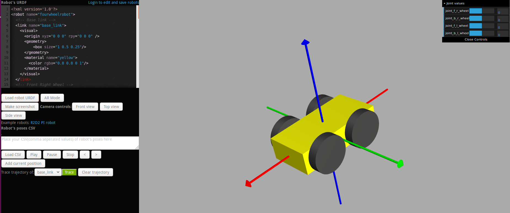
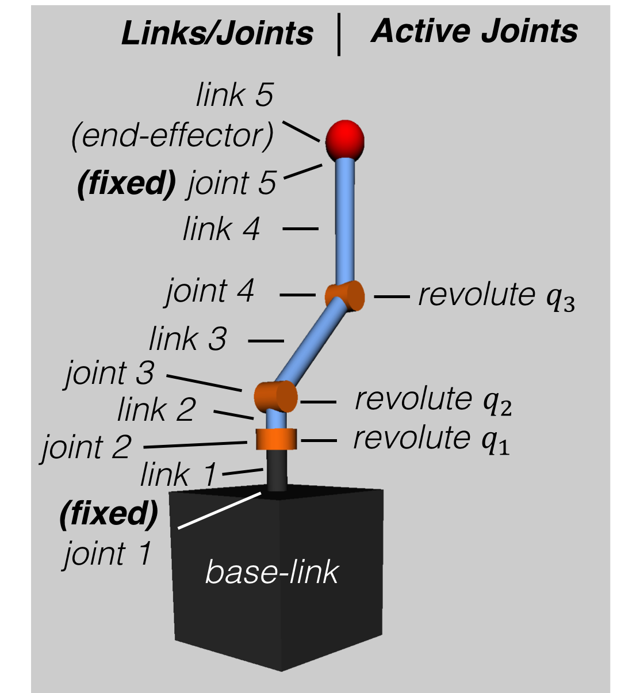
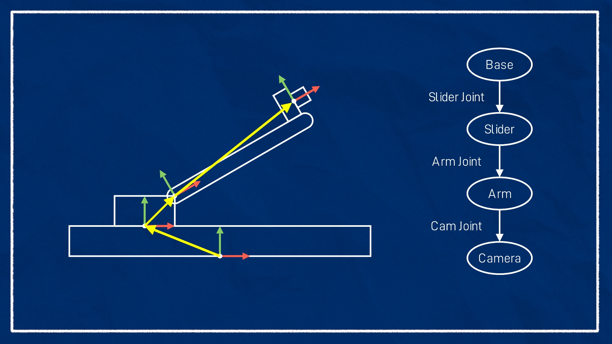
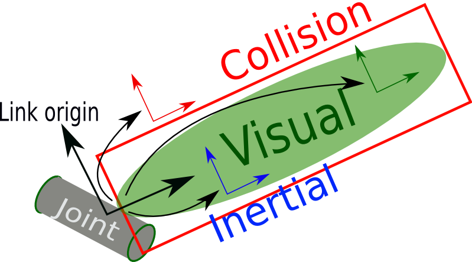
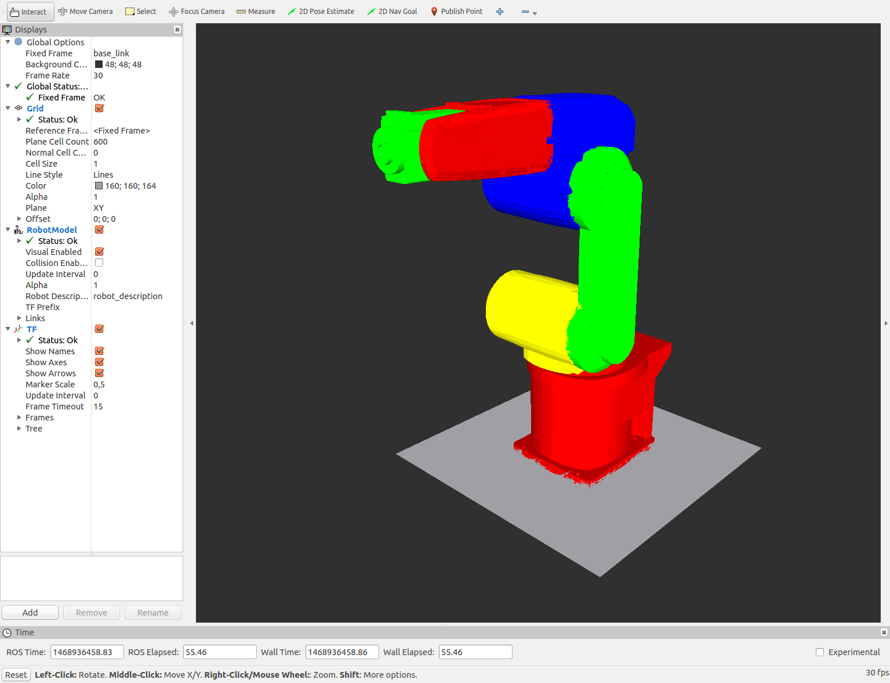
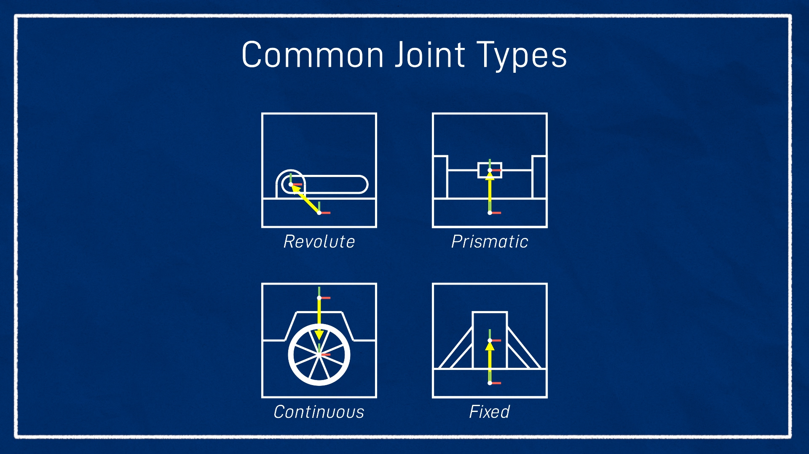
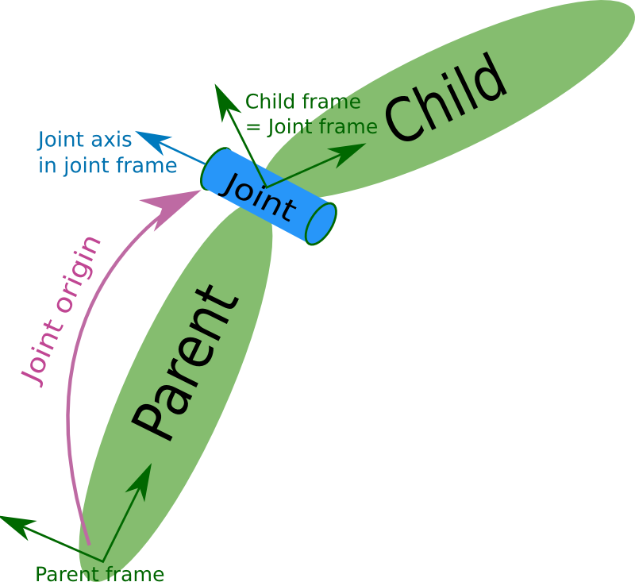
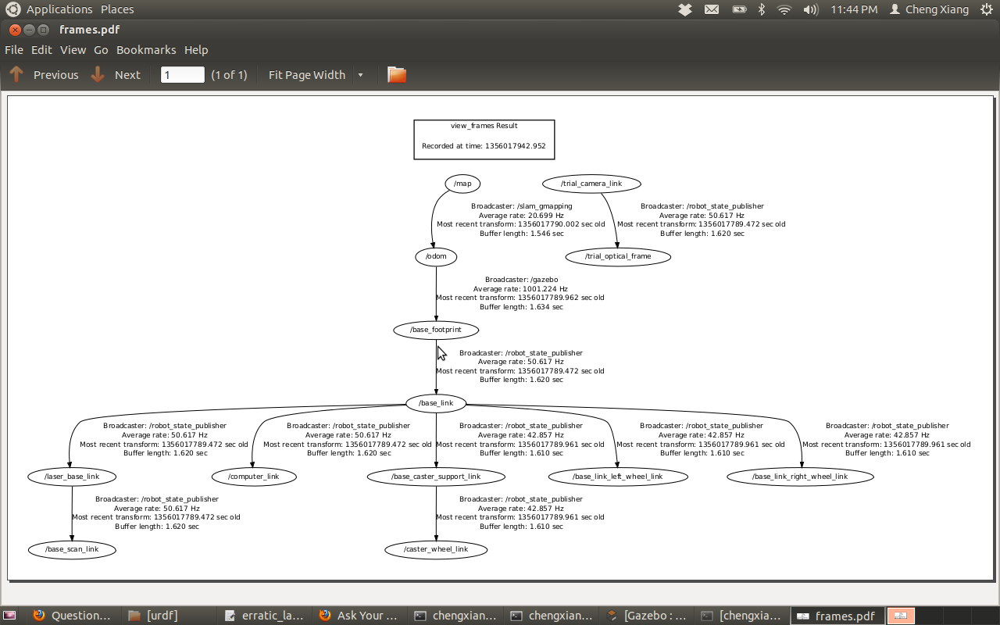

# URDF and Xacro for Beginners in ROS2

Welcome to the world of robot description in ROS2! This guide will help you understand URDF (Unified Robot Description Format) and Xacro, which are essential for describing your robot's structure, appearance, and behavior in ROS2 simulations and visualizations.

## Table of Contents
1. [What is URDF?](#what-is-urdf)
2. [What is Xacro?](#what-is-xacro)
3. [URDF vs Xacro](#urdf-vs-xacro)
4. [Simple Example](#simple-example)
5. [When to Use What?](#when-to-use-what)
6. [Understanding Robot Components](#understanding-robot-components)
   - [Links: The Building Blocks](#links-the-building-blocks)
   - [Joints: Connecting the Pieces](#joints-connecting-the-pieces)
7. [Building a Complete Robot](#building-a-complete-robot)
8. [Xacro: Writing URDF the Smart Way](#xacro-writing-urdf-the-smart-way)
9. [How ROS2 Uses URDF](#how-ros2-uses-urdf)

## What is URDF?

URDF stands for **Unified Robot Description Format**. It's like a blueprint or recipe that tells ROS2 everything about your robot's physical structure.

Think of URDF as a detailed description that includes:

- **Links**: The different parts of your robot (like wheels, arms, sensors)
- **Joints**: How these parts are connected and can move
- **Visuals**: What your robot looks like (colors, shapes)
- **Collisions**: Simplified shapes for detecting bumps and crashes
- **Inertial properties**: Weight and balance information for realistic physics

URDF files are written in XML format and are used by ROS2 tools like:
- **RViz**: For visualizing your robot
- **Gazebo**: For simulating your robot in a virtual world
- **robot_state_publisher**: For tracking where each part is located
- **MoveIt**: For planning robot movements



## What is Xacro?

Xacro (XML Macros) is like a smart helper for writing URDF files. Instead of writing everything from scratch each time, Xacro lets you reuse code and make your descriptions more organized.

**Key benefits of Xacro:**
- **Macros**: Reusable templates for common robot parts
- **Parameters**: Variables you can change easily
- **Conditionals**: "If-then" logic for different robot configurations
- **Loops**: Repeating elements without copy-pasting
- **Math**: Calculations within your robot description

Xacro files have a `.xacro` extension and get converted to regular URDF when ROS2 needs them.

## URDF vs Xacro

| Feature | URDF | Xacro |
|---------|------|-------|
| **Type** | Robot description format | Preprocessor for URDF |
| **File extension** | `.urdf` | `.urdf.xacro` |
| **Supports variables** | ❌ No | ✅ Yes |
| **Supports reuse (macros)** | ❌ No | ✅ Yes |
| **Supports conditionals** | ❌ No | ✅ Yes |
| **Readable for small robots** | ✅ Good | ✅ Good |
| **Maintainable for large robots** | ❌ Hard | ✅ Easy |
| **Used directly by ROS tools** | ✅ Yes | ❌ No (must be converted) |

## Simple Example

### Plain URDF
Here's a simple wheel described in basic URDF:

```xml
<link name="wheel">
  <visual>
    <geometry>
      <cylinder radius="0.1" length="0.05"/>
    </geometry>
  </visual>
</link>
```

### Xacro (Reusable Version)
With Xacro, you can create a template and reuse it:

```xml
<xacro:macro name="wheel" params="name radius length">
  <link name="${name}">
    <visual>
      <geometry>
        <cylinder radius="${radius}" length="${length}"/>
      </geometry>
    </visual>
  </link>
</xacro:macro>

<xacro:wheel name="left_wheel" radius="0.1" length="0.05"/>
<xacro:wheel name="right_wheel" radius="0.1" length="0.05"/>
```



Xacro helps you avoid repeating code and reduces mistakes!

## When to Use What?

### Use URDF only for:
- Very simple robots
- Quick prototypes
- Learning the basics

### Use Xacro for (recommended):
- Mobile robots (like TurtleBot or TortoiseBot)
- Robots with multiple similar parts (wheels, sensors)
- Different versions of the same robot
- Real projects (almost all ROS2 robots)

**One-line summary:**  
URDF describes *what* the robot is, while Xacro helps you *write* URDF efficiently.

## Understanding Robot Components

### Links: The Building Blocks

A **link** represents a solid, non-flexible part of your robot. It's like a LEGO brick that doesn't bend.

**Common examples:**
- `base_link`: The main body of the robot
- `wheel`: A wheel
- `lidar`: A laser scanner
- `camera`: A camera sensor

Each link can have up to 4 important sections:

1. **Visual**: How it looks (for visualization)
2. **Collision**: Simplified shape (for detecting collisions)
3. **Inertial**: Weight and balance (for physics simulation)




Here's an example of a base link:

```xml
<link name="base_link">
  <!-- How it looks in RViz -->
  <visual>
    <geometry>
      <box size="0.4 0.3 0.1"/>
    </geometry>
    <material name="blue">
      <color rgba="0 0 1 1"/>
    </material>
  </visual>

  <!-- For collision detection -->
  <collision>
    <geometry>
      <box size="0.4 0.3 0.1"/>
    </geometry>
  </collision>

  <!-- For realistic physics -->
  <inertial>
    <mass value="5.0"/>
    <inertia ixx="0.1" iyy="0.1" izz="0.1"
             ixy="0" ixz="0" iyz="0"/>
  </inertial>
</link>
```





**Important points:**
- Every robot needs at least one link
- `base_link` is usually the main part
- Visual, collision, and inertial shapes can be different!

### Joints: Connecting the Pieces

A **joint** connects two links and defines how they can move relative to each other.



**Joint Types** (very important!):
- **fixed**: No movement (like a sensor glued to the robot)
- **revolute**: Rotates with limits (like a door hinge)
- **continuous**: Rotates freely (like a wheel)
- **prismatic**: Moves in a straight line (like a drawer)
- **floating**: Can move in 6 directions (rare)
- **planar**: Moves in 2D (rare)



Example of a wheel joint:

```xml
<joint name="left_wheel_joint" type="continuous">
  <parent link="base_link"/>
  <child link="left_wheel"/>
  <!-- Position relative to parent -->
  <origin xyz="0 0.15 0" rpy="0 0 0"/>
  <!-- Rotation axis -->
  <axis xyz="0 1 0"/>
</joint>
```



**Important points:**
- Every link (except the base) has exactly one parent joint
- Joints create the robot's "family tree" of connections
- Wrong joints can break your robot in simulation!

## Building a Complete Robot

Putting links and joints together creates your robot's structure. Here's a simple mobile robot:

```
base_link
├── left_wheel (connected by left_wheel_joint)
├── right_wheel (connected by right_wheel_joint)
└── lidar_link (connected by lidar_joint)
```

This creates a robot with a body, two spinning wheels, and a fixed laser scanner.

## Xacro: Writing URDF the Smart Way

Xacro makes complex robots manageable. Here are the key features:

### Properties (Variables)
```xml
<xacro:property name="wheel_radius" value="0.1"/>
<xacro:property name="wheel_length" value="0.05"/>
```

### Macros (Reusable Templates)
```xml
<xacro:macro name="wheel" params="name x y">
  <link name="${name}">
    <visual>
      <geometry>
        <cylinder radius="${wheel_radius}" length="${wheel_length}"/>
      </geometry>
    </visual>
  </link>

  <joint name="${name}_joint" type="continuous">
    <parent link="base_link"/>
    <child link="${name}"/>
    <origin xyz="${x} ${y} 0" rpy="0 0 0"/>
    <axis xyz="0 1 0"/>
  </joint>
</xacro:macro>
```

### Using the Macro
```xml
<xacro:wheel name="left_wheel" x="0" y="0.15"/>
<xacro:wheel name="right_wheel" x="0" y="-0.15"/>
```

This expands into full URDF automatically!

## How ROS2 Uses URDF

The process works like this:

1. **Write Xacro file** (.urdf.xacro)
2. **Convert to URDF** (happens automatically)
3. **robot_state_publisher** reads URDF and creates TF frames
4. **RViz/Gazebo** use the information for visualization/simulation

### Converting Xacro to URDF

**Method 1: Command line**
```bash
ros2 run xacro xacro robot.urdf.xacro > robot.urdf
```

**Method 2: In launch files (most common)**
```python
robot_description = Command([
    "xacro ",
    PathJoinSubstitution([
        FindPackageShare("my_robot"),
        "urdf",
        "robot.urdf.xacro"
    ])
])
```

ROS2 handles the conversion automatically when launching your robot!



Now you're ready to start describing robots in ROS2. Start with simple URDF files and gradually move to Xacro as your robots become more complex. Happy robot building! 🤖