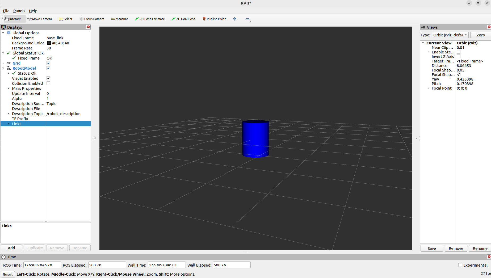

# Creating URDF from Scratch: A Beginner's Guide

Welcome to this beginner-friendly tutorial on creating Unified Robot Description Format (URDF) files from scratch in ROS2. URDF is an XML format used to describe the physical configuration of a robot, including links (parts) and joints (connections between parts).

## Prerequisites

Before we start, ensure you have the following installed:

- Ubuntu 22.04 LTS
- ROS2 Humble Hawksbill
- Required ROS2 packages: `joint-state-publisher`, `joint-state-publisher-gui`, `xacro`, `rviz2`

You can install the required packages with:

```bash
sudo apt update
sudo apt install ros-humble-joint-state-publisher ros-humble-joint-state-publisher-gui ros-humble-xacro
```

Verify your ROS2 installation:

```bash
printenv ROS_DISTRO
```

This should output `humble`.

## Step 1: Setting Up Your ROS2 Workspace

First, let's create a ROS2 workspace for our URDF project.

```bash
# Navigate to your workspace directory
cd ~/learning/ros2/ros2-humble-playground/11a.Custom-URDF

# Create the workspace structure
mkdir -p urdf_ws/src
cd urdf_ws

# Build the empty workspace
colcon build
```

## Step 2: Creating a ROS2 Package for URDF

Now, let's create a ROS2 package to hold our URDF files.

```bash
cd src
ros2 pkg create --build-type ament_cmake urdf_test
cd ..
```

This creates a package called `urdf_test` with the basic structure.

## Step 3: Understanding URDF Structure

A URDF file describes a robot using XML. The basic components are:

- **Links**: Physical parts of the robot (bodies, wheels, etc.)
- **Joints**: Connections between links (revolute, prismatic, fixed, etc.)
- **Materials**: Colors and textures for visualization

Here's a simple URDF structure:

```xml
<?xml version="1.0"?>
<robot name="robot_name">
  <!-- Define links here -->
  <link name="link_name">
    <!-- Visual properties -->
  </link>

  <!-- Define joints here -->
  <joint name="joint_name" type="joint_type">
    <!-- Joint properties -->
  </joint>
</robot>
```

## Step 4: Creating Your First URDF File

Let's create a simple robot with a base link. Create a file called `model.urdf` in the `urdf_test/urdf/` directory:

```xml
<?xml version="1.0"?>
<robot name="robot1">

  <!-- world frame -->
  <link name="world"/>

  <!-- base link -->
  <link name="base_link">
    <visual>
      <geometry>
        <cylinder length="1.0" radius="0.4"/>
      </geometry>
      <material name="blue">
        <color rgba="0 0 1 1"/>
      </material>
    </visual>
  </link>

  <!-- FIXED joint -->
  <joint name="world_to_base" type="fixed">
    <parent link="world"/>
    <child link="base_link"/>
    <origin xyz="0 0 0" rpy="0 0 0"/>
  </joint>

</robot>
```

This URDF defines:
- A `world` link (reference frame)
- A `base_link` with a blue cylinder geometry
- A fixed joint connecting world to base_link

## Step 5: Creating a Launch File

To visualize our robot, we need a launch file. Create `display.launch.py` in the `urdf_test/launch/` directory:

```python
import launch
from launch import LaunchDescription
import launch_ros
from launch.substitutions import Command, LaunchConfiguration, PathJoinSubstitution
from launch_ros.substitutions import FindPackageShare

def generate_launch_description():
    urdf_file = PathJoinSubstitution([
        FindPackageShare('urdf_test'),
        'urdf',
        'model.urdf'
    ])

    robot_description = Command(['cat ', urdf_file])

    parameters = {'robot_description': robot_description}

    robot_state_publisher_node = launch_ros.actions.Node(
        package='robot_state_publisher',
        executable='robot_state_publisher',
        parameters=[parameters]
    )

    joint_state_publisher_node_gui = launch_ros.actions.Node(
        package='joint_state_publisher_gui',
        executable='joint_state_publisher_gui',
        name='joint_state_publisher_gui',
        parameters=[parameters],
        condition=launch.conditions.IfCondition(LaunchConfiguration('gui'))
    )

    rviz_node = launch_ros.actions.Node(
        package='rviz2',
        executable='rviz2',
        name='rviz2',
        output='screen'
    )

    return LaunchDescription([
        launch.actions.DeclareLaunchArgument(
            'gui',
            default_value='true',
            description='Flag to enable joint_state_publisher_gui'
        ),
        launch.actions.DeclareLaunchArgument(
            'model',
            default_value=urdf_file,
            description='Absolute path to robot urdf file'
        ),
        robot_state_publisher_node,
        joint_state_publisher_node_gui,
        rviz_node
    ])
```

## Step 6: Building and Running

Build your package:

```bash
cd urdf_ws
colcon build
```

Source the workspace:

```bash
source install/setup.bash
```

Launch the visualization:

```bash
ros2 launch urdf_test display.launch.py
```

This will open RViz2 with your robot model. You should see a blue cylinder representing the base link.



## Step 7: Adding More Links and Joints

Let's extend our robot by adding a wheel. Update your `model.urdf`:

```xml
<?xml version="1.0"?>
<robot name="robot1">

  <!-- world frame -->
  <link name="world"/>

  <!-- base link -->
  <link name="base_link">
    <visual>
      <geometry>
        <cylinder length="1.0" radius="0.4"/>
      </geometry>
      <material name="blue">
        <color rgba="0 0 1 1"/>
      </material>
    </visual>
  </link>

  <!-- wheel link -->
  <link name="wheel">
    <visual>
      <geometry>
        <cylinder length="0.1" radius="0.2"/>
      </geometry>
      <material name="black">
        <color rgba="0 0 0 1"/>
      </material>
    </visual>
  </link>

  <!-- FIXED joint for base -->
  <joint name="world_to_base" type="fixed">
    <parent link="world"/>
    <child link="base_link"/>
    <origin xyz="0 0 0" rpy="0 0 0"/>
  </joint>

  <!-- REVOLUTE joint for wheel -->
  <joint name="base_to_wheel" type="revolute">
    <parent link="base_link"/>
    <child link="wheel"/>
    <origin xyz="0 0 -0.5" rpy="1.5708 0 0"/>
    <axis xyz="0 1 0"/>
    <limit lower="-3.14159" upper="3.14159" effort="100" velocity="10"/>
  </joint>

</robot>
```

Now rebuild and relaunch:

```bash
colcon build
source install/setup.bash
ros2 launch urdf_test display.launch.py
```

You should now see a wheel attached to the base that can rotate.

## Common URDF Elements

### Link Properties
- **visual**: How the link appears in RViz
- **collision**: Used for physics simulation
- **inertial**: Mass and inertia properties

### Joint Types
- **fixed**: No movement between links
- **revolute**: Rotates around an axis
- **prismatic**: Slides along an axis
- **continuous**: Rotates freely without limits

### Coordinate Systems
- **xyz**: Translation in x, y, z
- **rpy**: Rotation in roll, pitch, yaw (radians)

## Debugging URDF Issues

If your robot doesn't appear in RViz2, follow these debugging steps:

### Step 1: Create Required Directories and Files

First, ensure you have the necessary directories and files in your package:

```bash
cd urdf_ws/src/urdf_test
mkdir launch urdf
```

### Step 2: Add Required Files

Make sure you have:
- `urdf/model.urdf` - Your URDF file
- `launch/display.launch.py` - Your launch file
- Updated `CMakeLists.txt` with proper install directives

### Step 3: Build and Source

```bash
cd urdf_ws
colcon build
source install/setup.bash
```

### Step 4: Launch and Configure RViz

Launch your robot:

```bash
ros2 launch urdf_test display.launch.py
```

When RViz opens, configure it properly:

1. **Set Fixed Frame**: In RViz, go to `Global Options → Fixed Frame = base_link`
2. **Add RobotModel**: Click `Add → RobotModel`
3. **Set RobotModel**: Set RobotModel Topic Description - /robot_descrption

Your robot should now appear in RViz.

### Step 5: Verify TF and Robot Description

Check that `robot_state_publisher` is working:

```bash
# Check robot description is being published
ros2 topic echo /robot_description
```

Expected output (truncated):
```
data: '<?xml version="1.0"?> <robot name="robot1">
  <link name="base_link">
  <visual> <geometry> <cylinder length="1.0" radius="0.4"/> </...'
```

Check TF frames:

```bash
ros2 run tf2_tools view_frames
```

Expected output should show:
```
base_link: 
  parent: 'world'
  broadcaster: 'default_authority'
  rate: 10000.000
```

If `base_link` appears in the TF tree, your URDF is being processed correctly and should be visible in RViz.

## Next Steps

- Experiment with different geometries (box, sphere, mesh)
- Add more complex joint configurations
- Include collision and inertial properties
- Use Xacro for parameterized URDFs
- Integrate with Gazebo for simulation

Happy robot building! 


