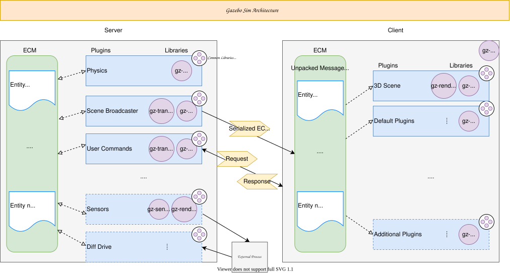
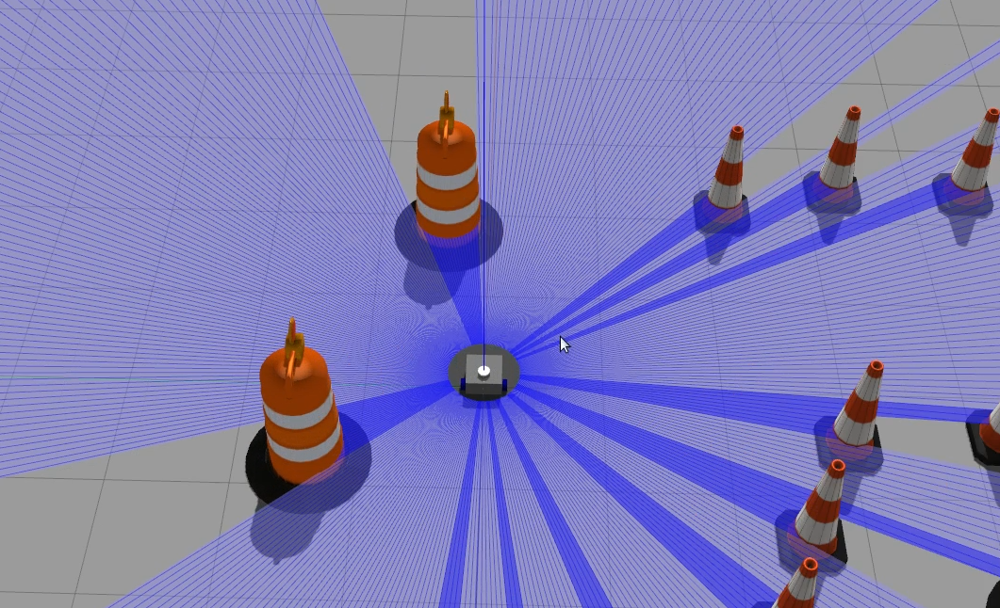
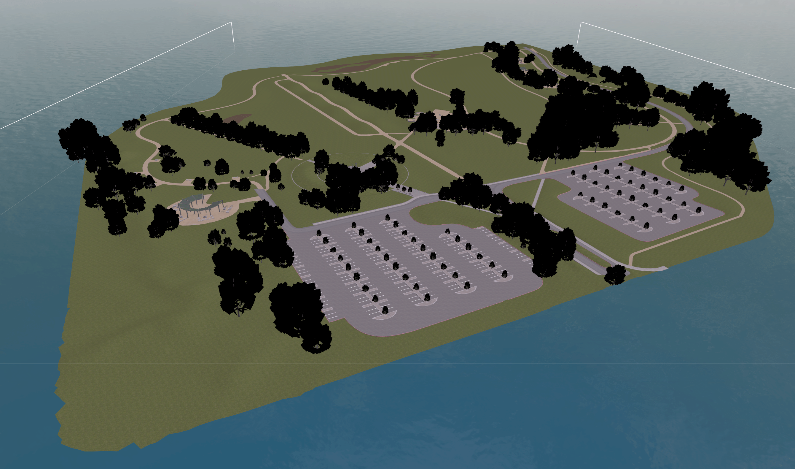
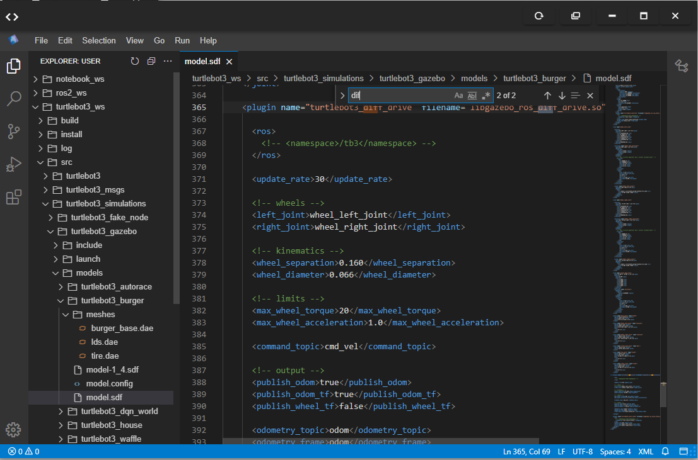
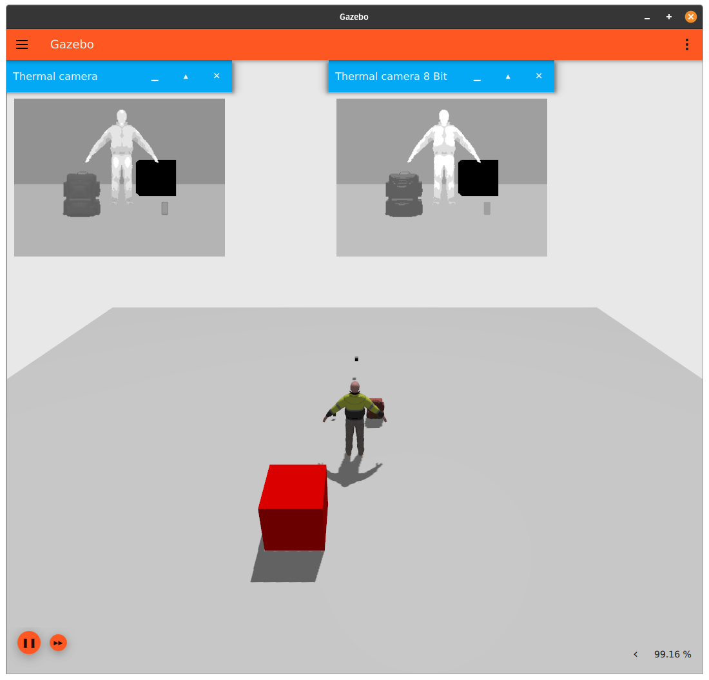
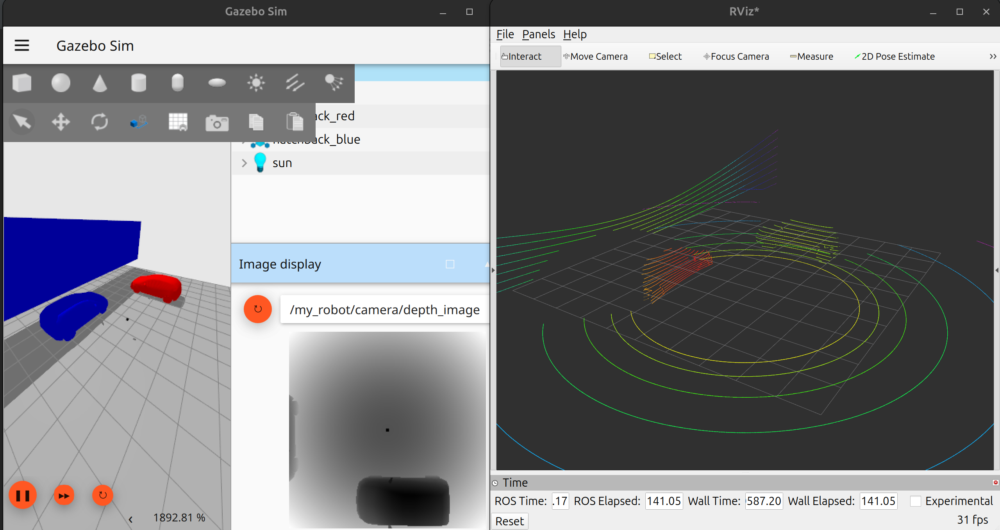

# Gazebo Plugins in ROS2: A Comprehensive Guide



## Table of Contents
- [What is a Gazebo Plugin?](#what-is-a-gazebo-plugin)
- [Why Plugins Are Needed](#why-plugins-are-needed)
- [Types of Gazebo Plugins](#types-of-gazebo-plugins)
- [How Gazebo Plugins Work with ROS2](#how-gazebo-plugins-work-with-ros2)
- [Using Plugins in URDF/Xacro](#using-plugins-in-urdf-xacro)
- [Major Gazebo ROS Plugins](#major-gazebo-ros-plugins)
- [Writing Custom Gazebo Plugins](#writing-custom-gazebo-plugins)
- [When to Use Plugins](#when-to-use-plugins)
- [Gazebo Classic vs Gazebo Sim (Ignition)](#gazebo-classic-vs-gazebo-sim-ignition)
- [References](#references)

## What is a Gazebo Plugin?

A Gazebo plugin is a shared library (typically written in C++) that extends Gazebo's simulation capabilities at runtime. It enables you to add dynamic behavior to simulated robots or the world that cannot be achieved with static URDF/SDF descriptions alone.

Think of plugins as the "brain" that brings life to your robot in simulation, handling control logic, sensor processing, and ROS integration.



## Why Plugins Are Needed

While URDF and SDF files describe the physical structure of robots, plugins provide the runtime behavior and logic. Here's a comparison:

| URDF/SDF | Gazebo Plugin |
|----------|---------------|
| Describes robot structure (links, joints) | Adds behavior and logic |
| Defines geometry, mass, visuals | Controls motors, reads sensors |
| Static description | Dynamic, runtime execution |

**Example:**
- **URDF**: "This robot has 2 wheels"
- **Plugin**: "When `/cmd_vel` arrives, rotate the wheels accordingly"

## Types of Gazebo Plugins

### 1. Model Plugin (Most Common)
Attached to a specific robot model to control joints and read states.

**Examples:**
- Differential drive controllers
- Ackermann steering
- Joint position/velocity controllers

### 2. Sensor Plugin
Attached to sensors to control data generation and publishing.

**Examples:**
- Camera plugins that publish images to ROS topics
- LiDAR plugins that publish `/scan` data
- IMU plugins for inertial measurement data

### 3. World Plugin
Affects the entire simulation environment with global logic.

**Examples:**
- Spawning/deleting models dynamically
- Changing gravity or physics properties
- Scenario control and automation



### 4. System Plugin
Runs at Gazebo startup. Less commonly used in typical ROS workflows.

## How Gazebo Plugins Work with ROS2

Gazebo plugins bridge the gap between ROS2 and Gazebo simulation:

```
ROS2 Node → /cmd_vel topic
        ↓
Gazebo Plugin
        ↓
Apply force/velocity to joints
        ↓
Robot moves in simulation
```

The plugin subscribes to ROS topics, processes the data, and applies the corresponding actions in the physics simulation.

## Using Plugins in URDF/Xacro

Plugins are integrated into your robot description using the `<gazebo>` tag in URDF or Xacro files:

```xml
<gazebo>
  <plugin name="diff_drive" filename="libgazebo_ros_diff_drive.so">
    <left_wheel>left_wheel_joint</left_wheel>
    <right_wheel>right_wheel_joint</right_wheel>
    <cmd_vel_topic>cmd_vel</cmd_vel_topic>
  </plugin>
</gazebo>
```



At runtime, Gazebo loads the specified `.so` shared library file and initializes the plugin with the provided parameters.

## Major Gazebo ROS Plugins

### Motion/Control Plugins
- `gazebo_ros_diff_drive` - Differential drive controller
- `gazebo_ros_control` - Generic controller interface
- `gazebo_ros_joint_state_publisher` - Publishes joint states

### Sensor Plugins
- `gazebo_ros_camera` - Camera sensor publishing images
- `gazebo_ros_depth_camera` - Depth camera with point clouds
- `gazebo_ros_laser` - Laser scanner publishing `/scan`
- `gazebo_ros_imu` - Inertial measurement unit



### Utility Plugins
- `gazebo_ros_p3d` - Pose (position/orientation) publisher
- `gazebo_ros_force` - Force/torque sensor
- `gazebo_ros_bumper` - Contact sensor

## Writing Custom Gazebo Plugins

Yes, you can write custom Gazebo plugins! This is very common for specialized applications.

**Typical use cases:**
- Custom robot controllers
- Non-standard sensors
- Special vehicle dynamics
- AI/reinforcement learning integration



### Minimal Custom Model Plugin Example

```cpp
#include <gazebo/gazebo.hh>
#include <gazebo/physics/physics.hh>

namespace gazebo
{
  class SimplePlugin : public ModelPlugin
  {
    public:
      void Load(physics::ModelPtr model, sdf::ElementPtr sdf)
      {
        this->model = model;
        this->updateConnection = event::Events::ConnectWorldUpdateBegin(
            std::bind(&SimplePlugin::OnUpdate, this));
      }

      void OnUpdate()
      {
        auto joint = model->GetJoint("wheel_joint");
        joint->SetVelocity(0, 5.0);
      }

    private:
      physics::ModelPtr model;
      event::ConnectionPtr updateConnection;
  };

  GZ_REGISTER_MODEL_PLUGIN(SimplePlugin)
}
```

This plugin would be compiled into a shared library (`libsimple_plugin.so`) and loaded by Gazebo.

## When to Use Plugins

**✅ Use plugins when you need:**
- Robot movement and control
- Sensor data processing and publishing
- ROS topic integration
- Realistic physics behavior
- Dynamic simulation logic

**❌ Plugins are not needed for:**
- Static model visualization only
- Pure URDF descriptions without behavior
- Simple geometric representations

## Gazebo Classic vs Gazebo Sim (Ignition)

| Gazebo Classic | Gazebo Sim (Ignition) |
|----------------|----------------------|
| Compatible with ROS1 & ROS2 | Future direction for ROS |
| Uses `gazebo_ros_*` plugins | Uses `ros_gz_*` packages |
| Traditional plugin API | Modern ECS-based architecture |

For ROS2 Humble, Gazebo Classic remains the most commonly used simulation environment.

## Simple Mental Model

- **URDF/SDF = Robot Body** (physical structure)
- **Plugin = Brain & Sensors** (behavior and perception)

## References

- [Official Gazebo Documentation](https://gazebosim.org/docs)
- [ROS2 Gazebo Integration](https://docs.ros.org/en/humble/Tutorials/Advanced/Simulators/Gazebo.html)
- [Gazebo ROS Packages](https://github.com/ros-simulation/gazebo_ros_pkgs)
- [Writing Gazebo Plugins Tutorial](https://gazebosim.org/docs/citadel/write_plugin)
- [ROS2 Humble Documentation](https://docs.ros.org/en/humble/)