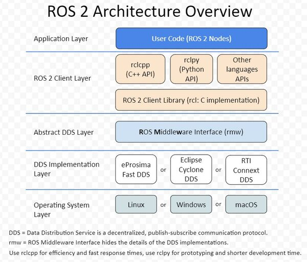

# What is ROS2?

ROS2 (Robot Operating System 2) is an open-source framework and set of tools designed for building robot applications. It provides a collection of software libraries and tools to help developers create complex robot behaviors from simpler components.

## Key Features

- **Modular Architecture**: ROS2 allows developers to build robot software as a collection of independent processes called nodes that communicate with each other.
- **Real-time Capabilities**: Improved support for real-time systems compared to ROS1.
- **Multi-platform Support**: Works on various operating systems including Linux, Windows, and macOS.
- **Security**: Built-in security features for secure communication between nodes.
- **Quality of Service (QoS)**: Fine-grained control over communication reliability and performance.

## Core Concepts

### Nodes
Nodes are the basic computational units in ROS2. Each node performs a specific task and can communicate with other nodes.

### Topics
Topics are named buses over which nodes exchange messages. Publishers send messages to topics, and subscribers receive them.

### Services
Services provide request-response communication between nodes. A service consists of a service server and one or more service clients.

### Actions
Actions are similar to services but support long-running tasks with feedback and the ability to cancel the task.

### Parameters
Parameters allow nodes to store and retrieve configuration values at runtime.

## Architecture

ROS2 uses a distributed architecture where:
- Nodes run independently
- Communication happens through middleware
- The default middleware is DDS (Data Distribution Service)

## DDS (Data Distribution Service)

DDS is a standard for real-time, scalable, and reliable data exchange. In ROS2:
- Provides publish-subscribe communication
- Supports Quality of Service policies
- Enables discovery of participants in the network

## ROS2 Distributions

ROS2 releases are organized into distributions with long-term support:
- Humble Hawksbill (May 2022) - LTS until May 2027
- Iron Irwini (May 2023)
- Jazzy Jalisco (May 2024) - LTS until May 2029
- Rolling Ridley (continuous release)

## Ecosystem

### Packages
ROS2 software is organized into packages containing:
- Source code
- Build files
- Configuration files
- Documentation

### Workspaces
Workspaces are directories where you can build and install ROS2 packages.

### Tools
ROS2 provides various command-line tools:
- `ros2 run`: Run a node
- `ros2 topic`: Interact with topics
- `ros2 service`: Interact with services
- `ros2 action`: Interact with actions
- `ros2 param`: Interact with parameters

## Getting Started

To get started with ROS2:
1. Install ROS2 (refer to [official installation guide](https://docs.ros.org/en/humble/Installation.html))
2. Set up your workspace
3. Create your first package
4. Build and run nodes

## Use Cases

ROS2 is used in various robotics applications:
- Autonomous vehicles
- Industrial robotics
- Drones
- Humanoid robots
- Mobile robots
- Robotic arms

## Comparison with ROS1

| Feature | ROS1 | ROS2 |
|---------|------|------|
| Architecture | Monolithic | Modular |
| Real-time | Limited | Enhanced |
| Security | Basic | Built-in |
| Multi-platform | Linux-focused | Cross-platform |
| Middleware | Custom | DDS-based |

## Resources

- [Official ROS2 Documentation](https://docs.ros.org/en/humble/)
- [ROS2 Wiki](https://wiki.ros.org/ROS2)
- [ROS Discourse](https://discourse.ros.org/)
- [ROS Answers](https://answers.ros.org/)

## Conclusion

ROS2 provides a powerful and flexible framework for developing robot software. Its modular design, real-time capabilities, and extensive ecosystem make it suitable for a wide range of robotics applications. Whether you're a beginner or an experienced developer, ROS2 offers the tools and community support needed to bring your robot ideas to life.