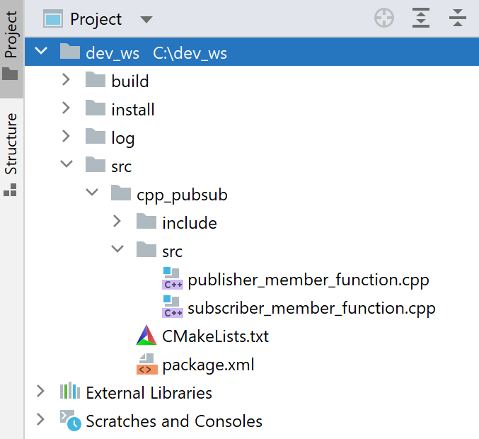
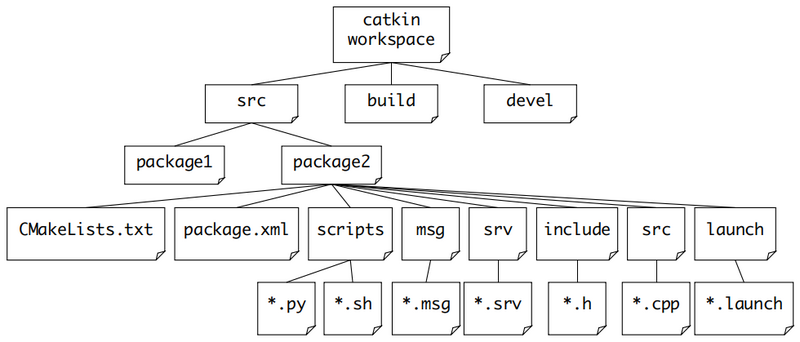
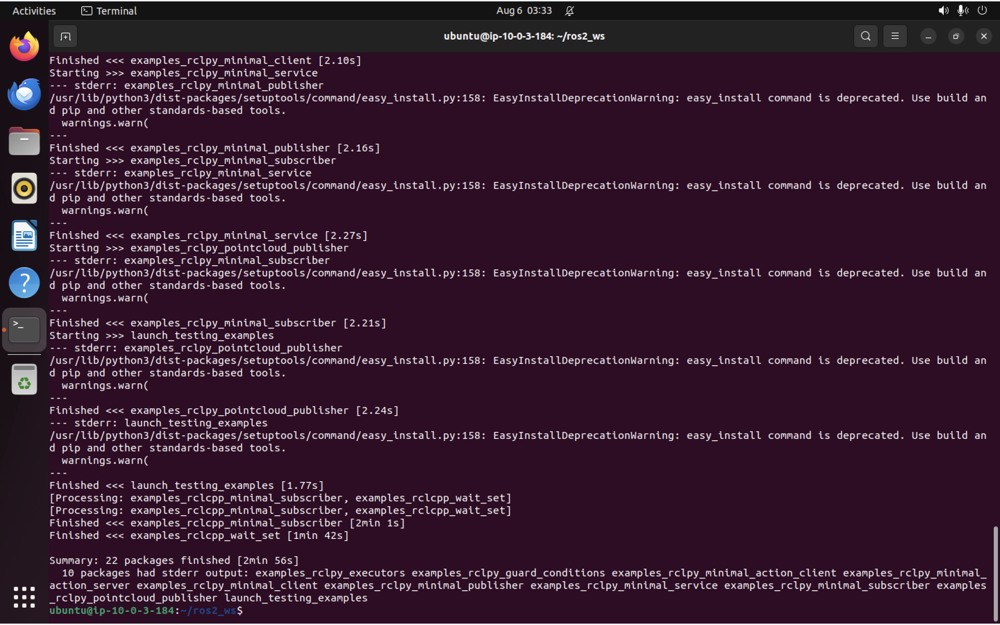

# ROS 2 Build & Packaging — Beginner Guide

A concise, beginner-friendly guide to building and packaging ROS 2 projects using `ament`, `colcon`, `rosdep`, and `CMake`.

---

## Quick links

- Official ROS 2 docs: https://docs.ros.org/en/humble/index.html
- Colcon: https://colcon.readthedocs.io/
- Ament (tutorials): https://index.ros.org/doc/ros2/Tutorials/
- rosdep: https://docs.ros.org/en/humble/Installation/Dependencies.html

---

## 1 — What you need to know (high level)

- Workspace: a folder containing many ROS 2 packages (typical layout: `src/`, `build/`, `install/`, `log/`).
- Package: a single unit (library / node / nodes) with `package.xml` and build instructions (`CMakeLists.txt` or `setup.py`).
- Tools:
  - `colcon` — builds the whole workspace
  - `ament` — the ROS 2 build extensions and macros (used via `ament_cmake` for C++)
  - `rosdep` — installs OS-level dependencies
  - `CMake` — the underlying build system for C++ packages



---

## 2 — Quick start (commands)

Follow these steps in order. Numbering indicates the recommended sequence.

1) One-time setup (do once per machine)

```bash
# Install ROS 2 (follow official instructions for your OS)
# Install and initialize rosdep (only once)
sudo rosdep init || true
rosdep update
```

2) Create a workspace (one-time per project)

```bash
mkdir -p ~/ros2_ws/src
cd ~/ros2_ws
```

3) Add or create packages inside `src/` (example: create a Python or C++ package)

```bash
# Python package (no CMakeLists.txt required)
ros2 pkg create my_py_pkg --build-type ament_python --dependencies rclpy

# C++ package (creates CMakeLists.txt)
ros2 pkg create my_cpp_pkg --build-type ament_cmake --dependencies rclcpp
```

4) Install OS-level dependencies for packages in `src/` (run from workspace root)

```bash
rosdep install --from-paths src --ignore-src -r -y
```

5) Source ROS 2 environment and build the workspace

```bash
source /opt/ros/humble/setup.bash
colcon build
```

6) Source the workspace install and run nodes

```bash
source install/setup.bash
ros2 run my_pkg my_node
```

Helpful build-time flags and troubleshooting:

```bash
# Build a single package
colcon build --packages-select my_pkg

# Faster Python development (no reinstall on change)
colcon build --symlink-install

# More verbose build output (helpful for debugging)
colcon build --event-handlers console_direct+
```



---

### Why there's no `CMakeLists.txt` in my package?

- Check the package's `package.xml`: the `<export><build_type>` value decides the build system.
- If `build_type` is `ament_python` the package uses `setup.py` (Python) and will not have a `CMakeLists.txt` file.
- If you need a C++ package (with `CMakeLists.txt`) create it using:

```bash
ros2 pkg create my_cpp_pkg --build-type ament_cmake --dependencies rclcpp
```

- If an existing package should be C++ but lacks `CMakeLists.txt`, update `package.xml` to set `<export><build_type>ament_cmake</build_type>` and add a `CMakeLists.txt` (or recreate with `ros2 pkg create`).


---

## 3 — Package types

- `ament_cmake` — Use for C++ packages. You write a `CMakeLists.txt`.
- `ament_python` — Use for Python packages. You write `setup.py` and simple Python modules.

Example minimal layouts:

C++ package:

```
my_cpp_pkg/
├── CMakeLists.txt
├── package.xml
└── src/
    └── my_node.cpp
```

Python package:

```
my_py_pkg/
├── package.xml
├── setup.py
└── my_py_pkg/
    └── node.py
```

---

## 4 — `package.xml` basics

`package.xml` declares metadata and dependencies. Minimal example:

```xml
<package format="3">
  <name>my_pkg</name>
  <version>0.0.1</version>
  <description>Example ROS 2 package</description>
  <maintainer email="you@example.com">Your Name</maintainer>
  <license>Apache-2.0</license>

  <buildtool_depend>ament_cmake</buildtool_depend>
  <depend>rclcpp</depend>

  <export>
    <build_type>ament_cmake</build_type>
  </export>
</package>
```

Tip: Use `ros2 pkg create` to generate a starter package.

```bash
ros2 pkg create my_py_pkg --build-type ament_python --dependencies rclpy
ros2 pkg create my_cpp_pkg --build-type ament_cmake --dependencies rclcpp
```

---

## 5 — Colcon basics

- Build workspace: `colcon build`
- Build a specific package: `colcon build --packages-select my_pkg`
- Useful flag during development: `--symlink-install` (Python packages update faster)



---

## 6 — rosdep

Before building, install OS-level dependencies for packages in `src/`:

```bash
rosdep install --from-paths src --ignore-src -r -y
```

This makes sure your system has libraries required by packages (e.g. system libraries for sensor drivers).

---

## 7 — Best practices for beginners

- Keep one node per file for readability.
- Use `ament_python` for algorithm/logic nodes (quick iteration).
- Use `ament_cmake` for drivers or performance-critical code.
- Always run `rosdep` after pulling new packages.
- Keep `src/` clean — no build artifacts in source.

---

## 8 — Helpful resources

- ROS 2 official tutorials: https://docs.ros.org/en/humble/Tutorials.html
- ROS 2 API docs: https://docs.ros.org/en/humble/api/index.html
- Colcon docs: https://colcon.readthedocs.io/

---


