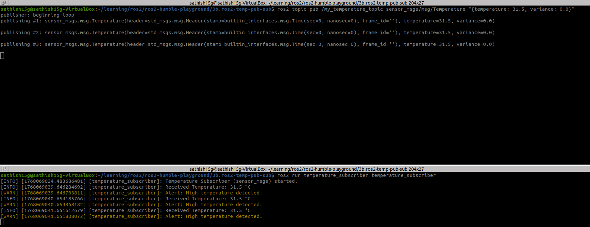

# ROS 2 Temperature Subscriber (sensor_msgs/Temperature)

## Project Overview

This project demonstrates a **custom ROS 2 Subscriber node** implemented using **Python (`rclpy`)**.
The subscriber listens to temperature readings published on a predefined ROS 2 topic using the
standard message type **`sensor_msgs/Temperature`**.

The subscriber processes incoming data and prints a **warning message whenever the temperature
exceeds a predefined threshold**, reinforcing the understanding of the ROS 2
publish–subscribe communication model and the role of a subscriber.

---

## Example Use Case

A monitoring or robotic system subscribes to temperature sensor data and:
- Displays normal temperature values
- Generates warnings when temperature exceeds a safe limit

This use case is common in:
- Robot safety monitoring
- Industrial automation
- Environmental sensing applications

---

## Objectives

- Understand and implement a **ROS 2 Subscriber node** using Python
- Listen to and process messages from a ROS 2 topic
- Implement callback-based message handling
- Apply appropriate **Quality of Service (QoS)** settings
- Validate subscriber functionality using ROS 2 CLI tools

---

## Software & Tools Used

| Component              | Details                      |
|------------------------|------------------------------|
| Operating System      | Ubuntu 22.04                |
| ROS Distribution      | ROS 2 Humble Hawksbill      |
| Programming Language  | Python                      |
| ROS Client Library    | rclpy                       |
| Message Type          | sensor_msgs/msg/Temperature |
| Tools                 | ros2 topic pub, ros2 topic echo, rqt_graph |

---

## Message Type Used

### `sensor_msgs/Temperature`

```
std_msgs/Header header
float64 temperature   # Temperature in Celsius
float64 variance      # Variance of the measurement (0.0 = unknown)
```

This standard ROS message type is recommended for temperature sensor data.

---

## Project Structure

```
ros2-temp-pub-sub
└── temperature_subscriber/
    ├── temperature_subscriber/
    │   └── temperature_subscriber_node.py
    ├── package.xml
    ├── setup.py
    ├── setup.cfg
    └── resource/
```

---

## Methodology

### Step 1: Create Workspace

```bash
mkdir -p ~/ros2_ws/src
cd ~/ros2_ws
```

### Step 2: Create Subscriber Package

```bash
cd ~/ros2_ws/src
ros2 pkg create temperature_subscriber \
  --build-type ament_python \
  --dependencies rclpy sensor_msgs
```

### Step 3: Implement Subscriber Node

- A subscriber is created for `/my_temperature_topic`
- A callback function processes incoming messages
- A threshold value is defined (e.g., 30 °C)
- Warning messages are logged if the threshold is exceeded

---

## Build Instructions

1. Source ROS 2

   ```bash
   source /opt/ros/humble/setup.bash
   ```

2. Build the Workspace

   ```bash
   cd ~/ros2_ws
   colcon build
   ```

   

3. Source the Workspace

   ```bash
   source install/setup.bash
   ```

---

## Running the Subscriber Node

### Start the Subscriber

```bash
ros2 run temperature_subscriber temperature_subscriber
```

Expected terminal output:

```
[INFO] Temperature Subscriber started (Threshold = 30.0 °C)
```


---

## Software Simulation & Testing

### Publish Test Data Using ROS 2 CLI

```bash
ros2 topic pub /my_temperature_topic sensor_msgs/msg/Temperature \
"{temperature: 31.5, variance: 0.0}"
```
### Manually publish the message




### Publisher pushes the message


### Verify Topic Information

```bash
ros2 topic info /my_temperature_topic
```

Expected:

```
Type: sensor_msgs/msg/Temperature
Publisher count: 1
Subscriber count: 1
```


---

## Flow Diagram (Using rqt_graph)

```bash
sudo apt install ros-humble-rqt-graph
rqt_graph
```

Expected message flow:

```
Publisher Node
      |
      v
/my_temperature_topic
      |
      v
Temperature Subscriber
```


---

## Problem-Solving Approach

### Issue: Subscriber not receiving messages

- Verified topic existence using `ros2 topic list`
- Checked message type using `ros2 topic info`

### Issue: Topic not visible in rqt_graph

- Identified that a subscriber must be active
- Resolved by running `ros2 topic pub` during visualization

---

## Debugging Tools Used

- ROS logging (INFO, WARN)
- `ros2 topic info`
- `rqt_graph`
- `ros2 doctor`

---

## Testing & Results

- Subscriber successfully received temperature messages
- Threshold-based warning logic worked correctly
- Messages were processed in real time
- ROS 2 CLI tools confirmed correct topic and message type

---

## Conclusion

This project demonstrates the implementation of a ROS 2 Subscriber node capable of receiving
and processing sensor data using standard ROS message types.

### Key Learnings

- Understanding subscriber behavior in ROS 2
- Callback-based message processing
- Applying QoS for reliable communication
- Debugging ROS 2 communication issues

### Future Enhancements

- Make temperature threshold configurable using ROS parameters
- Subscribe to multiple sensor topics
- Integrate visualization tools like RViz
- Extend logic to trigger control actions or alerts

