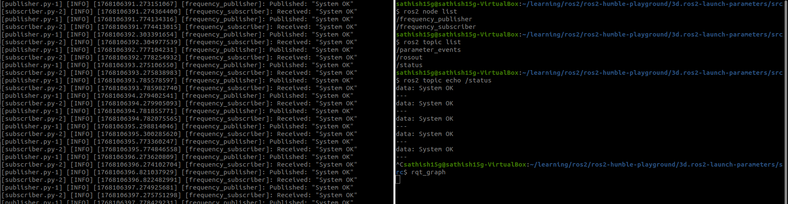

## 1. Introduction

### Purpose of ROS 2 Launch Files

ROS 2 launch files serve as configuration and automation tools that enable developers to start multiple ROS 2 nodes simultaneously with predefined parameters. They provide a declarative way to define the launch behavior of complex robotic systems, eliminating the need to manually start each node with individual commands.

## 2. Project Overview

### Publisher and Subscriber Launch Use Case

This project implements a ROS 2 launch system that demonstrates the automation of a classic publisher-subscriber communication pattern. The launch file coordinates the startup of two complementary nodes:

- **Frequency Publisher Node**: Publishes periodic status messages on a configurable topic
- **Frequency Subscriber Node**: Listens to the same topic and processes incoming messages

## 3. Project Objectives

The project was designed to achieve the following key objectives:

### Automation
- Implement automated startup of multiple ROS 2 nodes through launch files
- Eliminate manual node initialization processes

### Parameters
- Enable runtime configuration through launch arguments
- Implement dynamic parameter injection into nodes

### Modularity
- Create reusable launch configurations
- Separate node logic from launch configuration

## 4. Materials & Tools Used

### Core Technologies
- **ROS 2 Distribution**: Humble Hawksbill (LTS release)
- **Operating System**: Ubuntu 22.04 LTS
- **Programming Language**: Python 3.10
- **Build System**: colcon

### ROS 2 Specific Tools
- **launch**: Core launch system framework
- **launch_ros**: ROS 2 specific launch actions and utilities
- **rclpy**: Python client library for ROS 2

## 5. Package Structure

### ROS 2 Workspace Organization

```
my_launch_pkg/
├── launch/
│   └── pub_sub.launch.py
├── my_launch_pkg/
│   ├── __init__.py
│   ├── publisher.py
│   └── subscriber.py
├── package.xml
├── setup.py
├── setup.cfg
├── resource/
└── test/
```


## 6. Launch File Code

### Python .launch.py Implementation

```python
from launch import LaunchDescription
from launch_ros.actions import Node
from launch_ros.parameter_descriptions import ParameterValue
from launch.substitutions import LaunchConfiguration
from launch.actions import DeclareLaunchArgument

def generate_launch_description():
    # Declare launch arguments
    topic_name_arg = DeclareLaunchArgument(
        'topic_name',
        default_value='/frequency_chatter',
        description='Topic name for publisher and subscriber'
    )
    frequency_arg = DeclareLaunchArgument(
        'frequency',
        default_value='2.0',
        description='Publishing frequency in Hz'
    )

    # Create launch configurations
    frequency = LaunchConfiguration('frequency', default='2.0')
    topic_name = LaunchConfiguration('topic_name', default='/frequency_chatter')

    # Create publisher node with parameters
    publisher_node = Node(
        package='my_launch_pkg',
        executable='publisher.py',
        name='frequency_publisher',
        parameters=[{
            'frequency': ParameterValue(frequency, value_type=float),
            'topic_name': ParameterValue(topic_name, value_type=str)
        }]
    )

    # Create subscriber node with parameters
    subscriber_node = Node(
        package='my_launch_pkg',
        executable='subscriber.py',
        name='frequency_subscriber',
        parameters=[{
            'topic_name': ParameterValue(topic_name, value_type=str)
        }]
    )

    return LaunchDescription([
        topic_name_arg,
        frequency_arg,
        publisher_node,
        subscriber_node
    ])
```


## 7. Launch Arguments & Parameters

### LaunchConfiguration Implementation

| Argument | Type | Default Value | Description |
|----------|------|---------------|-------------|
| `topic_name` | String | `/frequency_chatter` | Communication topic for pub/sub |
| `frequency` | Float | `2.0` | Publishing frequency in Hz |

### Parameter Flow Architecture

1. **DeclareLaunchArgument**: Defines command-line configurable parameters
2. **LaunchConfiguration**: Retrieves parameter values at runtime
3. **ParameterValue**: Converts and validates parameter types
4. **Node Parameters**: Injects validated parameters into ROS 2 nodes

## 8. Methodology

### Step-by-Step Launch File Creation Process

1. **Package Setup**
   ```bash
   ros2 pkg create my_launch_pkg --build-type ament_python
   ```

2. **Node Implementation**
   - Create publisher.py with parameter handling
   - Create subscriber.py with topic subscription
   - Update setup.py with executable entries

3. **Launch File Development**
   - Import required launch modules
   - Declare launch arguments
   - Create LaunchConfiguration objects
   - Define Node actions with parameters

4. **Build and Test**
   ```bash
   colcon build
   source install/setup.bash
   ros2 launch my_launch_pkg pub_sub.launch.py
   ```

## 9. Problem-Solving Approach

### Common Errors and Debugging Strategies

#### Node Launch Failures
**Problem**: Nodes fail to start with "executable not found" errors
**Solution**: Verify executable entries in setup.py match actual filenames

#### Parameter Type Mismatches
**Problem**: Runtime errors due to incorrect parameter types
**Solution**: Use ParameterValue with explicit value_type specification

#### Topic Communication Issues
**Problem**: Publisher and subscriber not exchanging messages
**Solution**: Verify topic names match exactly between nodes

### Systematic Debugging Process

1. **Build Verification**: Ensure clean colcon build without errors
2. **Launch Validation**: Test launch file syntax with `ros2 launch --show-args`
3. **Node Inspection**: Use `ros2 node list` and `ros2 node info`
4. **Topic Monitoring**: Employ `ros2 topic echo` for message verification



## 10. Flowcharts / Diagrams

### Node Graph Architecture

```
┌─────────────────┐    ┌──────────────────┐
│ Frequency       │    │ Frequency        │
│ Publisher Node  │────│ Subscriber Node  │
│                 │    │                  │
│ • Publishes     │    │ • Subscribes     │
│   status msgs   │    │   to topic       │
│ • Configurable  │    │ • Logs received  │
│   frequency     │    │   messages       │
└─────────────────┘    └──────────────────┘
         │                       │
         └───── /frequency_chatter ─────┘
```

### Parameter Flow Diagram

```
Command Line Arguments
        │
        ▼
┌─────────────────────┐
│ DeclareLaunchArgument │
└─────────────────────┘
        │
        ▼
┌─────────────────────┐
│ LaunchConfiguration  │
└─────────────────────┘
        │
        ▼
┌─────────────────────┐
│ ParameterValue      │
└─────────────────────┘
        │
        ▼
┌─────────────────────┐
│ Node Parameters     │
└─────────────────────┘
```

## 11. Testing & Results

### Comprehensive Testing Methodology

#### Build Testing
```bash
colcon build --packages-select my_launch_pkg
```

#### Launch File Validation
```bash
ros2 launch my_launch_pkg pub_sub.launch.py --show-args
```

#### Runtime Verification
```bash
ros2 node list
ros2 topic list
ros2 topic echo /frequency_chatter
```

### Test Results Summary

✅ **Build Success**: Package compiles without errors
✅ **Launch Execution**: Launch file starts both nodes successfully
✅ **Parameter Injection**: Runtime parameters applied correctly
✅ **Topic Communication**: Publisher-subscriber communication established


## 12. Sample Launch Output

### Terminal Launch Sequence

```bash
$ ros2 launch my_launch_pkg pub_sub.launch.py topic_name:=/system_status frequency:=1.5
[INFO] [launch]: All log files can be found below /home/user/.ros/log/2026-01-11-12-30-45-123456
[INFO] [launch]: Default logging verbosity is set to INFO
[INFO] [frequency_publisher]: Launching Publisher on /system_status at 1.5 Hz
[INFO] [frequency_subscriber]: Subscriber listening on /system_status
[INFO] [frequency_publisher]: Published: "System OK"
[INFO] [frequency_subscriber]: Received: "System OK"
```

### Verification Commands Output

```bash
$ ros2 node list
/frequency_publisher
/frequency_subscriber

$ ros2 topic list
/system_status
```

## 13. Conclusion

### Learning Outcomes

This ROS 2 launch files project successfully demonstrated the power and flexibility of ROS 2's launch system in automating complex robotic applications. Key learning outcomes include:

#### Technical Proficiency
- **Launch System Mastery**: Deep understanding of ROS 2 launch architecture
- **Parameter Management**: Expertise in dynamic configuration and validation
- **Node Coordination**: Ability to orchestrate multi-node systems

#### System Design Skills
- **Modular Architecture**: Creating reusable and maintainable ROS 2 components
- **Configuration Management**: Implementing flexible parameter systems

### Project Impact

The implementation validates ROS 2 launch files as essential tools for:
- **Rapid Prototyping**: Quick deployment of multi-node systems
- **Production Deployment**: Reliable automation of complex robotic applications

## 14. Future Improvements

### Visualization Enhancements
- **RViz Integration**: Add 3D visualization capabilities to the launch file
- **Real-time Monitoring**: Implement dashboard for node status and performance metrics

### Quality of Service (QoS) Implementation
- **Reliability Settings**: Configure appropriate QoS profiles for different communication patterns
- **Performance Optimization**: Implement deadline and liveliness QoS policies

### Advanced Namespace Management
- **Multi-robot Support**: Implement namespace isolation for multiple robot instances
- **Component Grouping**: Organize nodes into logical namespaces for complex systems

### Lifecycle Management
- **Node Lifecycle**: Implement ROS 2 lifecycle nodes for controlled startup/shutdown
- **Health Monitoring**: Add node health checks and automatic recovery mechanisms