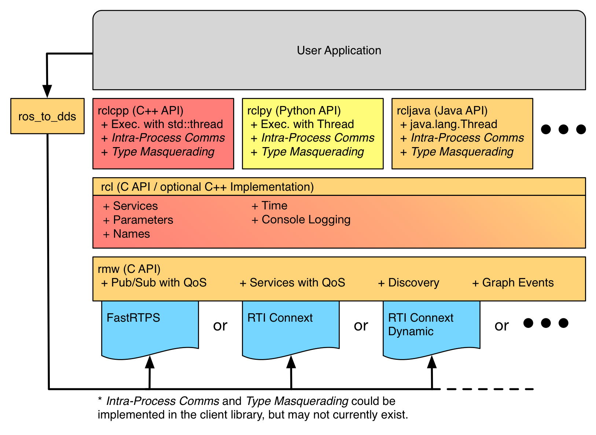
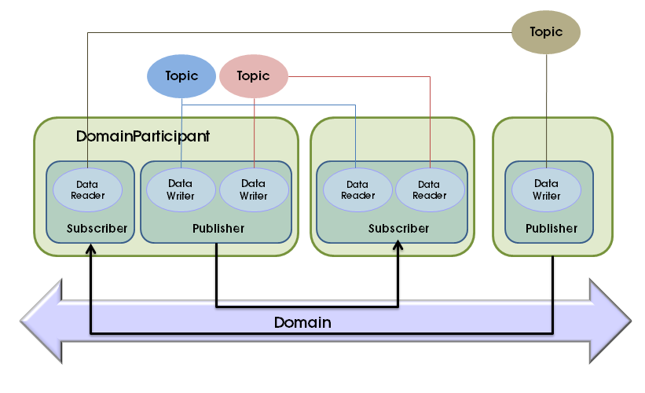
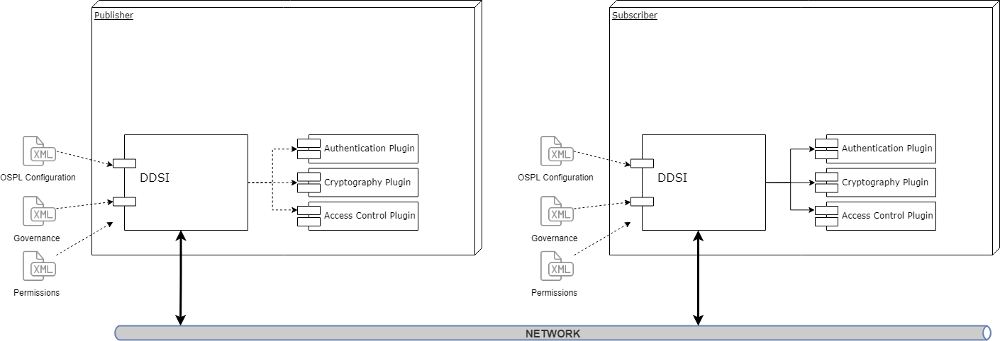

# DDS in ROS 2: Understanding the Communication Backbone

## Introduction to DDS

Data Distribution Service (DDS) is a middleware standard developed by the Object Management Group (OMG) for real-time, distributed publish-subscribe communication. In the context of ROS 2, DDS serves as the underlying communication layer, replacing the centralized ROS Master architecture of ROS 1.


ROS 2 can be conceptualized as: **ROS APIs + DDS Middleware**

## Why ROS 2 Adopted DDS

ROS 1 suffered from several architectural limitations:

- **Single Point of Failure**: Reliance on the ROS Master
- **Limited Real-Time Capabilities**: Inadequate for time-critical applications
- **Minimal QoS Control**: Insufficient quality of service guarantees
- **Security Concerns**: Lack of built-in security mechanisms

DDS addresses these challenges by providing:

- **Decentralized Architecture**: No single master node
- **Real-Time Communication**: Deterministic message delivery
- **Advanced QoS Policies**: Fine-grained control over communication behavior
- **Built-in Discovery**: Automatic peer detection and connection establishment
- **Security Features**: DDS-Security specification support

## DDS Architecture in ROS 2

The ROS 2 communication stack is layered as follows:

```
Your ROS 2 Node (rclcpp / rclpy)
        ↓
RCL (ROS Client Library)
        ↓
RMW (ROS Middleware Interface)
        ↓
DDS Implementation
        ↓
Network Layer (UDP / TCP)
```



The RMW (ROS Middleware) abstraction layer enables ROS 2 to support multiple DDS implementations without requiring changes to user code.

## DDS Core Concepts Mapped to ROS 2

| DDS Concept | ROS 2 Equivalent | Description |
|-------------|------------------|-------------|
| Domain | ROS Domain (ROS_DOMAIN_ID) | Logical separation of communication domains |
| Topic | ROS Topic | Named communication channel |
| Publisher | ROS Publisher | Entity that sends data |
| Subscriber | ROS Subscriber | Entity that receives data |
| DataWriter | Publisher Internals | DDS-level data transmission |
| DataReader | Subscriber Internals | DDS-level data reception |
| QoS | ROS QoS Profiles | Quality of service policies |
| DomainParticipant | Node Context | DDS participant managing publishers/subscribers |


## DDS Discovery Mechanism

DDS employs automatic peer discovery, eliminating the need for a central coordination service:

- **Self-Announcement**: Nodes broadcast their presence on the network
- **Topic Matching**: Publishers and subscribers connect based on topic names and QoS compatibility
- **Decentralized Operation**: No central server required

Discovery protocols include:

- **Simple Discovery**: Default method for small to medium systems
- **Static Discovery**: Pre-configured discovery for large-scale deployments
- **Discovery Server**: Centralized discovery service (available in Fast DDS)

This distributed discovery is why ROS 2 nodes can communicate without a `roscore` equivalent.



## DDS Quality of Service (QoS)

QoS policies define the behavior and guarantees of data communication. Key policies include:

| QoS Policy | Options | Description |
|------------|---------|-------------|
| Reliability | Reliable / Best Effort | Delivery guarantees |
| Durability | Transient / Volatile | Data persistence across reconnections |
| History | Keep Last / Keep All | Message buffering strategy |
| Depth | Integer value | Queue size for buffered messages |
| Deadline | Duration | Maximum acceptable latency |
| Liveliness | Various modes | Node health monitoring |

Example ROS 2 QoS configuration:

```python
from rclpy.qos import QoSProfile, QoSReliabilityPolicy

qos = QoSProfile(
    reliability=QoSReliabilityPolicy.RELIABLE,
    depth=10
)
```

**Important**: Publisher and subscriber QoS policies must be compatible for communication to occur.

## DDS Implementations in ROS 2

ROS 2 supports multiple DDS vendors through the RMW abstraction:

| DDS Vendor | ROS 2 Support | Notes |
|------------|----------------|-------|
| Fast DDS (eProsima) | ✅ Default | Open-source, high performance |
| Cyclone DDS | ✅ Supported | Lightweight, fast discovery |
| RTI Connext DDS | ✅ Commercial | Enterprise-grade, real-time |
| GurumDDS | ⚠️ Limited | Industrial applications |

To switch DDS implementations:

```bash
export RMW_IMPLEMENTATION=rmw_cyclonedds_cpp
```

## DDS Message Flow

The message transmission process in ROS 2 via DDS:

1. Publisher creates a DataWriter for a topic
2. Subscriber creates a DataReader for the same topic
3. DDS discovery protocol identifies compatible peers
4. QoS compatibility verification occurs
5. Direct peer-to-peer communication established
6. Data flows without intermediate brokers

This architecture enables true distributed, masterless communication.

## DDS Security in ROS 2

DDS incorporates comprehensive security through the DDS-Security specification:

- **Authentication**: Node identity verification
- **Encryption**: Data-in-transit protection
- **Access Control**: Fine-grained permissions

ROS 2 security is implemented via DDS-Security plugins. Enable security:

```bash
export ROS_SECURITY_ENABLE=true
export ROS_SECURITY_STRATEGY=Enforce
```

Security is critical for applications in autonomous vehicles, industrial robotics, and defense systems.



## Practical Example: ROS 2 Node with DDS

```python
import rclpy
from rclpy.node import Node
from std_msgs.msg import String

class TalkerNode(Node):
    def __init__(self):
        super().__init__('talker')
        self.publisher = self.create_publisher(String, 'chatter', 10)
        self.timer = self.create_timer(1.0, self.publish_message)

    def publish_message(self):
        msg = String()
        msg.data = "Hello DDS from ROS 2"
        self.publisher.publish(msg)
        self.get_logger().info(f'Publishing: "{msg.data}"')

def main(args=None):
    rclpy.init(args=args)
    node = TalkerNode()
    rclpy.spin(node)
    node.destroy_node()
    rclpy.shutdown()

if __name__ == '__main__':
    main()
```

This message transmission occurs entirely through DDS protocols, independent of ROS-specific networking layers.

## DDS vs ROS 1 Transport Comparison

| Feature | ROS 1 | ROS 2 (DDS) |
|---------|-------|-------------|
| Central Coordinator | Required (ROS Master) | ❌ Decentralized |
| Discovery | Centralized | Distributed |
| QoS Support | Minimal | Advanced |
| Real-Time Performance | Limited | Excellent |
| Security | None | Built-in |
| Scalability | Limited | High |

## When DDS Provides Maximum Value

DDS excels in demanding robotics applications:

- **Multi-Robot Systems**: Coordinated swarm operations
- **Autonomous Vehicles**: Time-critical sensor fusion
- **Industrial Automation**: Deterministic control systems
- **Safety-Critical Robotics**: Guaranteed message delivery

## Conclusion

DDS forms the robust communication foundation of ROS 2, enabling real-time, secure, scalable, and decentralized inter-node communication. Understanding DDS concepts is essential for developing high-performance robotics applications with ROS 2.

For further reading, refer to the [ROS 2 DDS documentation](https://docs.ros.org/en/humble/Concepts/About-DDS.html) and DDS specifications from OMG.