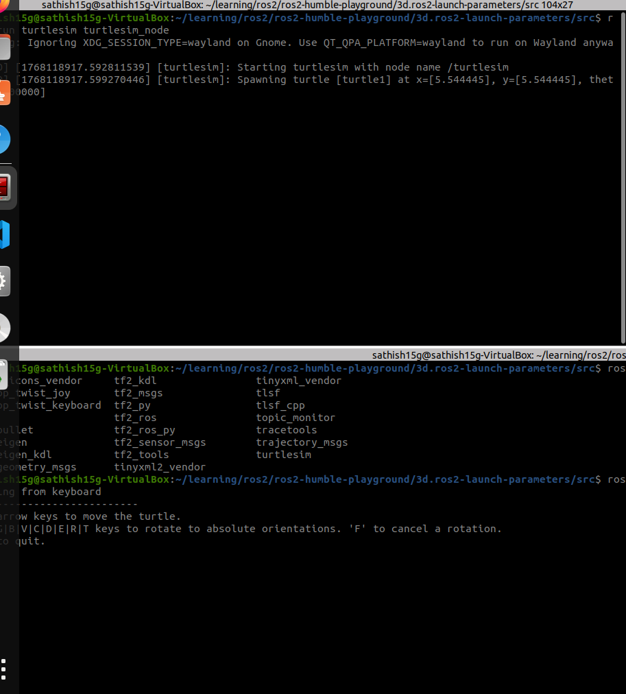

# 🐢 Turtlesim – ROS 2 Learning Simulator

## 1. Introduction

### What is Turtlesim?

**Turtlesim** is a simple, lightweight 2D simulator provided with ROS 2. It is primarily designed for **learning and teaching ROS 2 fundamentals** without the complexity of real robots or heavy simulators.

Turtlesim allows developers and students to:
- Understand ROS 2 architecture
- Practice inter-node communication
- Learn how publishers, subscribers, services, parameters, and actions work
- Experiment safely before moving to real robots or advanced simulators



## 2. Why Turtlesim?

Turtlesim is often the **first ROS 2 package** introduced because:
- Easy to install and run
- Visual feedback is immediate
- Covers most ROS 2 core concepts
- Minimal hardware and system requirements

## 3. Prerequisites

### System Requirements
- **Operating System**: Ubuntu 20.04 / 22.04
- **ROS 2 Distribution**: Humble, Iron, or Jazzy
- **Knowledge Level**: Basic Linux terminal knowledge

### ROS 2 Verification
```bash
ros2 --version
```

## 4. Installation

### Standard Installation

Turtlesim is included in most ROS 2 desktop installations.

### Manual Installation (if missing)
```bash
sudo apt update
sudo apt install ros-<distro>-turtlesim
```

**Example for Humble:**
```bash
sudo apt install ros-humble-turtlesim
```

## 5. Getting Started

### Launching Turtlesim

**Start the simulator:**
```bash
ros2 run turtlesim turtlesim_node
```

**Control the turtle:**
```bash
ros2 run turtlesim turtle_teleop_key
```

*Use arrow keys to move the turtle around the screen.*

## 6. ROS 2 Architecture in Turtlesim

### Nodes

Turtlesim consists of multiple nodes that work together:

- **turtlesim_node** – Main simulator and turtle renderer
- **turtle_teleop_key** – Keyboard input publisher for control

**List active nodes:**
```bash
ros2 node list
```

### Topics

Turtlesim uses ROS 2 topics for communication between nodes.

**List available topics:**
```bash
ros2 topic list
```

#### Key Topics

| Topic | Type | Description |
|-------|------|-------------|
| `/turtle1/cmd_vel` | `geometry_msgs/Twist` | Velocity commands for movement |
| `/turtle1/pose` | `turtlesim/Pose` | Current position and orientation |

**Monitor turtle position:**
```bash
ros2 topic echo /turtle1/pose
```


### Publishers & Subscribers

- **teleop_turtle** (Publisher) → Publishes velocity commands
- **turtlesim_node** (Subscriber) → Receives commands and updates turtle position
- **turtlesim_node** (Publisher) → Publishes pose updates for monitoring

**Manual velocity control example:**
```bash
ros2 topic pub /turtle1/cmd_vel geometry_msgs/msg/Twist "{linear: {x: 1.0}, angular: {z: 1.0}}"
```

### Services

Turtlesim exposes several ROS 2 services for interaction.

**List available services:**
```bash
ros2 service list
```

#### Common Services

| Service | Description |
|---------|-------------|
| `/spawn` | Create a new turtle |
| `/kill` | Remove a turtle |
| `/clear` | Clear drawings |
| `/reset` | Reset simulator |

**Spawn a new turtle:**
```bash
ros2 service call /spawn turtlesim/srv/Spawn "{x: 3.0, y: 3.0, theta: 0.0, name: 'turtle2'}"
```

### Parameters

Turtlesim supports runtime parameter configuration.

**List parameters:**
```bash
ros2 param list
```

**Change background color to black:**
```bash
ros2 param set /turtlesim background_r 0
ros2 param set /turtlesim background_g 0
ros2 param set /turtlesim background_b 0
```

## 7. Role of RCL (ROS Client Library)

### What is RCL?

RCL (ROS Client Library) is the core communication layer of ROS 2. It provides a language-agnostic API that all ROS 2 client libraries rely on.

**Examples:**
- **rclcpp** → C++ client library
- **rclpy** → Python client library

*Turtlesim internally uses RCL through rclcpp*

### How RCL Helps in Turtlesim

RCL handles all low-level ROS 2 operations, allowing developers to focus on application logic instead of middleware complexity.

**RCL provides:**
- Node creation and management
- Publisher & subscriber management
- Service & client handling
- Parameter handling
- Timers and callbacks
- DDS middleware abstraction

## 8. RCL Flow in Turtlesim

### Communication Flow Diagram

```
Keyboard Input
      ↓
turtle_teleop_key (Publisher)
      ↓          [RCL]
   DDS Middleware
      ↓          [RCL]
turtlesim_node (Subscriber)
      ↓
Turtle Movement & Rendering
```

### Publisher via RCL

When `turtle_teleop_key` publishes velocity data:

1. RCL creates/manages the node
2. RCL creates/manages the publisher
3. Message is serialized by RCL
4. DDS transports the message
5. Subscriber callback is triggered through RCL

*You never interact with DDS directly — RCL abstracts it completely.*

### Services via RCL

When calling services like `/spawn`:

1. RCL matches client and server
2. RCL handles request/response lifecycle
3. RCL ensures reliability via DDS
4. RCL triggers service callbacks safely

### Parameters via RCL

When parameters change:

1. RCL updates the parameter server
2. RCL notifies the affected node
3. RCL applies changes at runtime (no restart needed)

## 9. DDS + RCL Relationship

### Layer Architecture

| Layer | Responsibility |
|-------|----------------|
| **Application** | Turtlesim logic |
| **rclcpp / rclpy** | ROS API |
| **RCL** | Core ROS functionality |
| **DDS** | Transport & discovery |
| **OS** | Networking |

## 10. Launch Files

### Simplifying Multi-Node Startup

Launch files simplify starting multiple nodes simultaneously.

**Example launch:**
```bash
ros2 launch turtlesim turtlesim_launch.py
```

Launch files rely on RCL to:
- Initialize nodes properly
- Apply parameters automatically
- Control execution lifecycle
- Manage inter-node dependencies

## 11. Learning Outcomes

By using Turtlesim, you will learn:

### Core ROS 2 Concepts
- ROS 2 communication model (pub/sub, services, parameters)
- Importance of middleware abstraction
- Multi-language support through RCL
- Real-time distributed system concepts

### Practical Skills
- Node creation and management
- Topic-based communication
- Service-oriented architecture
- Parameter configuration
- Launch file usage

## 12. Limitations

### Current Constraints
- **2D only** - No 3D visualization
- **No physics simulation** - Simple kinematic model
- **Not suitable for real robot testing** - Educational tool only

### When to Move Beyond Turtlesim

After mastering Turtlesim fundamentals, explore:

- **Gazebo / Ignition** - Physics-based simulation
- **Nav2** - Navigation and path planning
- **SLAM** - Simultaneous Localization and Mapping
- **Real robot drivers** - Hardware integration

## 13. Practical Examples

### Drawing Shapes

**Create a circular motion:**
```bash
ros2 topic pub --once /turtle1/cmd_vel geometry_msgs/msg/Twist "{linear: {x: 1.0}, angular: {z: 1.0}}"
```


### Multi-Turtle Scenarios

**Spawn multiple turtles:**
```bash
ros2 service call /spawn turtlesim/srv/Spawn "{x: 5.0, y: 5.0, theta: 1.57, name: 'turtle2'}"
ros2 service call /spawn turtlesim/srv/Spawn "{x: 7.0, y: 3.0, theta: 0.0, name: 'turtle3'}"
```

**Control different turtles:**
```bash
ros2 topic pub /turtle2/cmd_vel geometry_msgs/msg/Twist "{linear: {x: 0.5}, angular: {z: 0.5}}"
```

## 14. Troubleshooting

### Common Issues

#### Turtle Not Moving
**Problem:** Arrow keys don't control the turtle
**Solution:** Ensure both `turtlesim_node` and `turtle_teleop_key` are running in separate terminals

#### Service Call Failures
**Problem:** Service calls return errors
**Solution:** Check service names with `ros2 service list` and ensure correct message types

#### Parameter Changes Not Applied
**Problem:** Parameter changes don't take effect
**Solution:** Verify parameter names with `ros2 param list` and check node namespace

## 15. References

### Official Documentation
- **ROS 2 Docs**: https://docs.ros.org
- **Turtlesim Package**: https://github.com/ros/ros_tutorials
- **RCL Design**: https://design.ros2.org

### Additional Resources
- **ROS 2 Tutorials**: https://docs.ros.org/en/humble/Tutorials.html
- **ROS Answers**: https://answers.ros.org
- **ROS Discourse**: https://discourse.ros.org

## 16. Conclusion

Turtlesim serves as a foundational learning tool in ROS 2, demonstrating how complex distributed robotics systems can be built using clean, scalable, and language-independent abstractions. With RCL acting as the backbone, it provides an excellent introduction to ROS 2 concepts before moving to more advanced simulation and real-world applications.

**Happy ROS 2 Learning! 🐢🚀**

