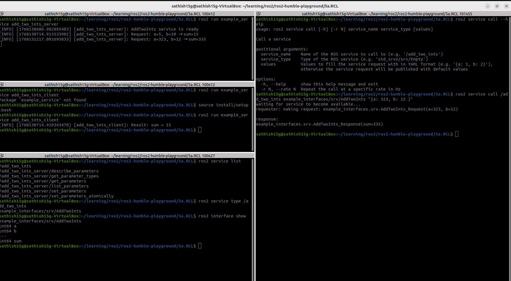

# ROS 2 Services and Clients: AddTwoInts Example

This guide demonstrates how to implement ROS 2 services and clients using the `AddTwoInts` service from `example_interfaces`.

## 1. Create a ROS 2 Python Package

```bash
cd ~/ros2_ws/src
ros2 pkg create example_service --build-type ament_python --dependencies rclpy example_interfaces
```

We use the `example_interfaces/AddTwoInts` service.

## 2. Service Server Implementation

**File:** `example_service/example_service/add_two_ints_server.py`

```python
import rclpy
from rclpy.node import Node
from example_interfaces.srv import AddTwoInts

class AddTwoIntsServer(Node):

    def __init__(self):
        super().__init__('add_two_ints_server')
        self.srv = self.create_service(
            AddTwoInts,
            'add_two_ints',
            self.callback
        )
        self.get_logger().info('AddTwoInts service is ready')

    def callback(self, request, response):
        response.sum = request.a + request.b
        self.get_logger().info(
            f'Request: a={request.a}, b={request.b} → sum={response.sum}'
        )
        return response

def main():
    rclpy.init()
    node = AddTwoIntsServer()
    rclpy.spin(node)
    rclpy.shutdown()

if __name__ == '__main__':
    main()
```

## 3. Client Implementation

**File:** `example_service/example_service/add_two_ints_client.py`

```python
import rclpy
from rclpy.node import Node
from example_interfaces.srv import AddTwoInts

class AddTwoIntsClient(Node):

    def __init__(self):
        super().__init__('add_two_ints_client')
        self.client = self.create_client(AddTwoInts, 'add_two_ints')

        while not self.client.wait_for_service(timeout_sec=1.0):
            self.get_logger().info('Waiting for service...')

        self.request = AddTwoInts.Request()

    def send_request(self, a, b):
        self.request.a = a
        self.request.b = b
        self.future = self.client.call_async(self.request)
        rclpy.spin_until_future_complete(self, self.future)
        return self.future.result()

def main():
    rclpy.init()
    node = AddTwoIntsClient()
    response = node.send_request(5, 10)
    node.get_logger().info(f'Result: sum = {response.sum}')
    rclpy.shutdown()

if __name__ == '__main__':
    main()
```

## 4. Register Executables (VERY IMPORTANT ⚠️)

**File:** `example_service/setup.py`

Add inside `entry_points`:

```python
entry_points={
    'console_scripts': [
        'add_two_ints_server = example_service.add_two_ints_server:main',
        'add_two_ints_client = example_service.add_two_ints_client:main',
    ],
},
```

## 5. Build & Source Workspace

```bash
cd ~/ros2_ws
colcon build
source install/setup.bash
```

## 6. Run Service and Client (Two Terminals)

### Terminal 1 – Start Service

```bash
ros2 run example_service add_two_ints_server
```

**Output:**

```
AddTwoInts service is ready
```

### Terminal 2 – Run Client

```bash
ros2 run example_service add_two_ints_client
```

**Output:**

```
Result: sum = 15
```



## 7. Verify Using ROS CLI (Optional)

### Check service:

```bash
ros2 service list
```

### Call service manually:

```bash
ros2 service call /add_two_ints example_interfaces/srv/AddTwoInts "{a: 3, b: 7}"
```

## 8. Key Concepts (Exam Ready 🧠)

| Concept              | Explanation                          |
|----------------------|--------------------------------------|
| Service              | Request–response communication       |
| Server               | Waits for request, sends response    |
| Client               | Sends request, waits for response    |
| .srv file            | Defines request & response           |
| spin()               | Required to process callbacks        |
| Async call           | Non-blocking (recommended)           |
| wait_for_service()   | Ensures server availability          |

## 9. Industrial Mapping

| Example              | Service                               |
|----------------------|---------------------------------------|
| Reset sensor         | Trigger service                       |
| Enable motor         | Boolean service                       |
| Set speed            | Parameter service                     |
| Diagnostics          | Request system status                 |

## ✅ Summary

You implemented a full ROS 2 Service & Client

- Used `rclpy` + `AddTwoInts`
- Works on Humble / Jazzy
- Perfect for exam + real robotics use