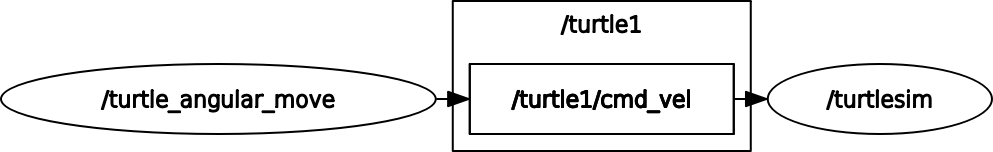

# 🐢 Custom Turtlesim Movement Package

## 1. Overview

This ROS 2 package demonstrates different turtle movement patterns using the Turtlesim simulator. The package includes three distinct movement behaviors that showcase various ROS 2 concepts including publishers, timers, and state machines.

### Package Features
- **Linear Movement**: Straight-line turtle motion
- **Angular Movement**: Circular motion combining linear and angular velocity
- **Square Movement**: Complex pattern using state machine logic

## 2. Prerequisites

### System Requirements
- **ROS 2 Distribution**: Humble Hawksbill or later
- **Python**: 3.8 or higher
- **Turtlesim Package**: `ros-humble-turtlesim`

### Installation
```bash
sudo apt update
sudo apt install ros-humble-turtlesim
```

## 3. Package Structure

```
my_turtlesim_pkg/
├── launch/
├── my_turtlesim_pkg/
│   ├── __init__.py
│   ├── turtle_linear_move.py    # Linear movement node
│   ├── turtle_angular_move.py   # Angular movement node
│   ├── turtle_square_move.py    # Square movement node
├── package.xml
├── setup.py
├── setup.cfg
└── README.md
```

## 4. Linear Turtle Movement

### Description
The linear movement node moves the turtle in a straight line by publishing constant linear velocity on the `/turtle1/cmd_vel` topic.

### Code Implementation

```python
class TurtleLinearMove(Node):
    def __init__(self):
        super().__init__('turtle_linear_move')
        self.publisher = self.create_publisher(Twist, 'turtle1/cmd_vel', 10)
        self.timer = self.create_timer(1.0, self.move_turtle)

    def move_turtle(self):
        twist = Twist()
        twist.linear.x = 2.0  # Constant forward velocity
        self.publisher.publish(twist)
        self.get_logger().info(f'Linear Velocity X: {twist.linear.x}')
```

### Running Linear Movement

**Terminal 1 - Start Turtlesim:**
```bash
ros2 run turtlesim turtlesim_node
```

**Terminal 2 - Run Linear Movement:**
```bash
ros2 run my_turtlesim_pkg turtle_linear_move
```

### Expected Behavior
- Turtle moves continuously in a straight line
- Velocity: 2.0 units/second in X direction
- No rotation (angular velocity = 0)


## 5. Angular Turtle Movement

### Description
The angular movement node creates circular motion by combining both linear and angular velocity, causing the turtle to move in a curved path.

### Code Implementation

```python
class TurtleAngulaeMove(Node):
    def __init__(self):
        super().__init__('turtle_angular_move')
        self.publisher = self.create_publisher(Twist, 'turtle1/cmd_vel', 10)
        self.timer = self.create_timer(1.0, self.move_turtle)

    def move_turtle(self):
        twist = Twist()
        twist.linear.x = 1.0   # Forward velocity
        twist.angular.z = 1.0  # Rotational velocity
        self.publisher.publish(twist)
        self.get_logger().info(f'Combined movement - Linear: {twist.linear.x}, Angular: {twist.angular.z}')
```

### Running Angular Movement

**Terminal 1 - Start Turtlesim:**
```bash
ros2 run turtlesim turtlesim_node
```

**Terminal 2 - Run Angular Movement:**
```bash
ros2 run my_turtlesim_pkg turtle_angular_move
```

### Expected Behavior
- Turtle moves in a circular path
- Linear velocity: 1.0 units/second
- Angular velocity: 1.0 radians/second
- Creates smooth circular motion


## 6. Square Turtle Movement

### Description
The square movement node implements a state machine to move the turtle in a square pattern, alternating between moving forward and turning 90 degrees.

### Code Implementation

```python
class TurtleSquareMove(Node):
    def __init__(self):
        super().__init__('turtle_square_move')
        self.publisher = self.create_publisher(Twist, 'turtle1/cmd_vel', 10)
        self.timer = self.create_timer(1.0, self.move_turtle)
        self.side_count = 0
        self.state = 'move'  # 'move' or 'turn'

    def move_turtle(self):
        twist = Twist()
        if self.state == 'move':
            twist.linear.x = 1.0
            self.publisher.publish(twist)
            self.get_logger().info('Moving Forward')
            self.state = 'turn'
        elif self.state == 'turn':
            twist.angular.z = 1.57  # 90 degrees in radians
            self.publisher.publish(twist)
            self.get_logger().info('Turning 90 degrees')
            self.side_count += 1
            if self.side_count >= 4:
                self.get_logger().info('Completed square movement')
                self.timer.cancel()
            else:
                self.state = 'move'
```

### Running Square Movement

**Terminal 1 - Start Turtlesim:**
```bash
ros2 run turtlesim turtlesim_node
```

**Terminal 2 - Run Square Movement:**
```bash
ros2 run my_turtlesim_pkg turtle_square_move
```

### Expected Behavior
- Turtle moves forward for 1 second
- Turtle turns 90 degrees (1.57 radians)
- Repeats for 4 sides to complete square
- Automatically stops after completing the square


## 7. ROS 2 Concepts Demonstrated

### Publishers and Topics
- All nodes publish `Twist` messages to `/turtle1/cmd_vel`
- Demonstrates one-to-one publisher-subscriber communication
- Real-time velocity control

### Timers and Callbacks
- Each node uses ROS 2 timers for periodic execution
- `create_timer()` with callback functions
- 1-second intervals for movement updates

### State Machines
- Square movement implements finite state machine
- Alternates between 'move' and 'turn' states
- Demonstrates complex behavior logic

### Message Types
- Uses `geometry_msgs/Twist` for velocity commands
- Linear and angular velocity components
- Standard ROS 2 message interface

## 8. Building and Installation

### Build the Package
```bash
cd ~/ros2_ws
colcon build --packages-select my_turtlesim_pkg
source install/setup.bash
```

### Verify Installation
```bash
ros2 pkg list | grep my_turtlesim_pkg
```

## 9. Testing and Verification

### Monitor Topics
```bash
# List available topics
ros2 topic list

# Monitor velocity commands
ros2 topic echo /turtle1/cmd_vel

# Monitor turtle pose
ros2 topic echo /turtle1/pose
```

### Check Node Status
```bash
# List running nodes
ros2 node list

# Check node information
ros2 node info /turtle_linear_move
```

### Debug Output
```bash
# Enable debug logging
ros2 run my_turtlesim_pkg turtle_square_move --ros-args --log-level debug
```


## 10. ROS Graph Visualization

### Understanding Node Relationships
```bash
# Install ROS graph tools
sudo apt install ros-humble-rqt-graph

# Launch graph visualizer
rqt_graph
```

### Expected Graph Structure
- **turtlesim_node**: Central simulator node
- **Movement nodes**: Publisher nodes (linear/angular/square)
- **Topics**: `/turtle1/cmd_vel`, `/turtle1/pose`



## 11. Customization and Extensions

### Modifying Movement Parameters

**Change Linear Velocity:**
```python
# In turtle_linear_move.py
twist.linear.x = 3.0  # Faster movement
```

**Adjust Angular Velocity:**
```python
# In turtle_angular_move.py
twist.angular.z = 2.0  # Faster rotation
```

**Modify Square Size:**
```python
# In turtle_square_move.py
twist.linear.x = 2.0  # Longer sides
```

### Adding New Movement Patterns

**Create Spiral Movement:**
```python
class TurtleSpiralMove(Node):
    def __init__(self):
        super().__init__('turtle_spiral_move')
        self.publisher = self.create_publisher(Twist, 'turtle1/cmd_vel', 10)
        self.timer = self.create_timer(0.1, self.move_spiral)
        self.radius = 0.0

    def move_spiral(self):
        twist = Twist()
        twist.linear.x = 1.0
        twist.angular.z = 1.0 / (self.radius + 1.0)  # Decreasing angular velocity
        self.publisher.publish(twist)
        self.radius += 0.01
```

## 12. Troubleshooting

### Common Issues

#### Turtle Not Moving
**Problem:** Turtle doesn't respond to movement commands
**Solution:**
- Ensure turtlesim_node is running
- Check topic names match (`/turtle1/cmd_vel`)
- Verify message format is correct

#### Node Not Found Error
**Problem:** `ros2 run` can't find the node
**Solution:**
- Build the package: `colcon build`
- Source the workspace: `source install/setup.bash`
- Check package name and entry points

#### Permission Errors
**Problem:** Cannot publish to topics
**Solution:**
- Check ROS 2 environment is properly sourced
- Verify user has necessary permissions
- Ensure turtlesim is running with correct namespace

#### Timer Not Working
**Problem:** Movement callbacks not executing
**Solution:**
- Check timer creation syntax
- Verify callback function exists
- Ensure node is properly initialized

## 13. Performance Considerations

### Timer Frequency
- **High frequency** (0.1s): Smooth but CPU intensive
- **Low frequency** (1.0s): Less smooth but efficient
- **Balance** based on application requirements

### Message Publishing
- **Continuous publishing**: Real-time control
- **Event-based publishing**: Efficient for state changes
- **Rate limiting**: Prevent message flooding

### Resource Management
- **Timer cleanup**: Properly cancel timers when done
- **Node destruction**: Clean shutdown procedures
- **Memory management**: Avoid memory leaks in long-running nodes

## 14. Educational Value

### Learning Objectives
- **ROS 2 Node Creation**: Basic node structure and lifecycle
- **Publisher Implementation**: Message publishing patterns
- **Timer Usage**: Periodic task execution
- **State Machines**: Complex behavior implementation
- **Message Types**: Understanding ROS 2 message interfaces

### Advanced Concepts
- **Real-time Control**: Velocity-based robot control
- **Coordinate Systems**: Understanding turtle movement
- **Feedback Loops**: Position monitoring and adjustment
- **Error Handling**: Robust node operation

## 15. Future Enhancements

### Movement Patterns
- **Figure-8 Movement**: Complex curved path following
- **Random Walk**: Autonomous exploration behavior
- **Follow-the-Leader**: Multi-turtle coordination
- **Obstacle Avoidance**: Sensor-based navigation

### Advanced Features
- **Parameter Configuration**: Runtime movement adjustment
- **Service Integration**: External control interfaces
- **Action Servers**: Long-running movement tasks
- **Multi-turtle Coordination**: Swarm behavior simulation

### Visualization Improvements
- **Path Tracking**: Movement trail visualization
- **Real-time Metrics**: Performance monitoring dashboard
- **3D Visualization**: RViz integration for advanced analysis

## 16. References

### ROS 2 Documentation
- [ROS 2 Tutorials](https://docs.ros.org/en/humble/Tutorials.html)
- [Turtlesim Package](https://github.com/ros/ros_tutorials)
- [geometry_msgs Documentation](https://docs.ros.org/en/humble/api/geometry_msgs/index-msg.html)

### Additional Resources
- [ROS 2 Node Tutorial](https://docs.ros.org/en/humble/Tutorials/Beginner-Client-Libraries/Writing-A-Simple-Py-Publisher-And-Subscriber.html)
- [Timer Tutorial](https://docs.ros.org/en/humble/Tutorials/Beginner-Client-Libraries/Timers.html)
- [ROS Answers](https://answers.ros.org)

## 17. Conclusion

This custom Turtlesim package demonstrates fundamental ROS 2 concepts through practical turtle movement implementations. Each movement pattern showcases different programming techniques and ROS 2 capabilities, providing a solid foundation for understanding robotic control systems.

The package serves as both an educational tool and a starting point for more complex robotic applications, illustrating how simple movement commands can create sophisticated robotic behaviors.

**Happy Turtling! 🐢🤖**


---

## 👤 Author

**Sathish Kumar G**  
Robotics & ROS 2  

🔗 LinkedIn: https://www.linkedin.com/in/sathish15g/

## 📄 License

This project is licensed under the **Apache License 2.0**.  

You are free to use, modify, distribute, and sublicense this work under the terms of the license.  
For full license details, see the [LICENSE](../LICENSE) file in this repository.

---