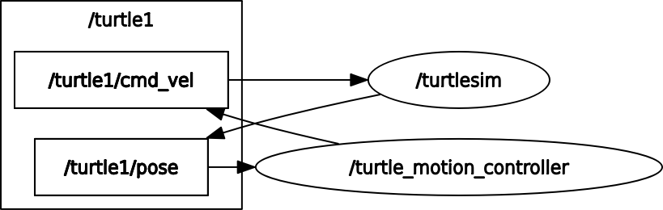

# 1. Project Overview

This mini project demonstrates the implementation of a custom ROS 2 node that controls the motion of a turtle in the **turtlesim** environment. The node publishes velocity commands to move the turtle in straight lines and rotate it by precise angles, ultimately making the turtle trace a square path starting from its initial position.

The project reinforces core ROS 2 concepts such as node creation, publishers, subscribers, services, and basic motion control using feedback from sensors.


---

## 2. Objectives

* Create a custom ROS 2 node using `rclpy`
* Publish velocity commands using `geometry_msgs/Twist`
* Subscribe to pose feedback using `turtlesim/Pose`
* Use ROS 2 services to reset and clear the simulator
* Implement linear and angular motion functions
* Make the turtle move in a square trajectory

---

## 3. System Requirements

* Ubuntu 22.04
* ROS 2 (Humble or compatible distribution)
* turtlesim package
* Python 3

---

## 4. ROS 2 Concepts Used

* **Node**: Custom motion controller node
* **Publisher**: Publishes velocity commands to `/turtle1/cmd_vel`
* **Subscriber**: Subscribes to `/turtle1/pose` for feedback
* **Services**: Uses `/clear` and `/reset` services
* **Messages**: `Twist`, `Pose`
* **Spin and Callbacks**: `rclpy.spin_once()` for real-time feedback



---

## 5. Project Structure

```
ros2_ws/
 └── src/
     └── turtle_motion_controller/
         ├── turtle_motion_controller.py
         ├── package.xml
         ├── setup.py
         └── README.md
```

---

## 6. Functional Description

### 6.1 Pose Tracking

The turtle’s position and orientation are continuously updated by subscribing to the `/turtle1/pose` topic. This feedback is used to control angular motion accurately.

### 6.2 Linear Motion

The turtle moves forward at a constant linear speed for a fixed duration. This is used to draw each side of the square.


### 6.3 Angular Rotation

After completing each side, the turtle rotates by **90 degrees** using pose-based angle feedback. Angle normalization ensures rotation occurs in the shortest direction.


### 6.4 Square Path Execution

The turtle repeats linear motion followed by a 90-degree rotation four times, resulting in a square trajectory.


---

## 7. Logging and Debugging

The node uses ROS 2 logging to provide clear runtime information, including:

* Start of each side movement
* Current operation (linear or angular motion)
* Completion of the square path

These logs help in understanding execution flow and debugging motion behavior.


---

## 8. How to Run the Project

### Step 1: Start turtlesim

```bash
ros2 run turtlesim turtlesim_node
```

### Step 2: Run the motion controller node

```bash
ros2 run turtle_motion_controller turtle_motion_controller
```

---

## 9. Expected Output

* The turtle starts from its default position
* The screen is cleared and reset
* The turtle moves forward and rotates alternately
* A square shape is drawn on the turtlesim window

Minor variations in the square shape may occur due to timing and execution delays, which are expected in time-based motion control.


---

## 10. Conclusion

This mini project successfully demonstrates the use of ROS 2 communication mechanisms and basic motion control using feedback. It provides hands-on experience with publishers, subscribers, services, and logging while controlling a simulated robot in a structured manner.
