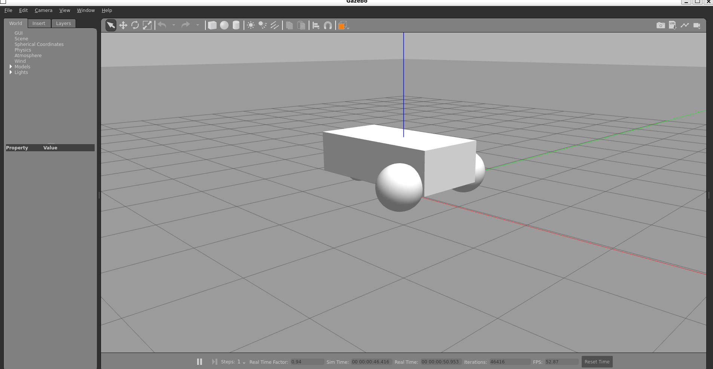

# Gazebo Classic with ROS 2 – Introduction & Basic Testing

## 📌 Table of Contents
- [What is Gazebo?](#-what-is-gazebo)
- [Why use Gazebo with ROS 2?](#-why-use-gazebo-with-ros-2)
- [System Requirements](#️-system-requirements)
- [Installation Steps](#-installation-steps)
- [Basic Testing with Gazebo](#-basic-testing-with-gazebo)
- [Reference Links](#-reference-links)
- [Conclusion](#-conclusion)
- [Author](#-author)

## 📌 What is Gazebo?
Gazebo is an open-source **robot simulation environment** that allows developers to simulate robots in realistic 3D environments with physics, sensors, and actuators. It is widely used with **ROS (Robot Operating System)** to test robot behavior before deploying on real hardware.

Gazebo provides:
- Realistic physics simulation
- 3D visualization
- Sensor simulation (Lidar, camera, IMU, etc.)
- Integration with ROS topics, services, and TF

**Gazebo Classic (Gazebo 11)** is commonly used with **ROS 2 Humble**.

---

## 📌 Why use Gazebo with ROS 2?
- Test robot motion without physical hardware
- Validate control algorithms safely
- Debug ROS nodes using simulated robots
- Reduce development cost and risk

---

## 🖥️ System Requirements
- Ubuntu 22.04 (Native or WSL2)
- ROS 2 Humble
- Gazebo Classic (Gazebo 11)

---

## 📦 Installation Steps

### 1️⃣ Install ROS 2 Humble
Follow the official ROS 2 installation guide:
```bash
https://docs.ros.org/en/humble/Installation.html
```

After installation, source ROS:
```bash
source /opt/ros/humble/setup.bash
```

### 2️⃣ Install Gazebo Classic
```bash
sudo apt update
sudo apt install gazebo
```

Verify installation:
```bash
gazebo --version
```

### 3️⃣ Install Gazebo–ROS Integration Packages
```bash
sudo apt install ros-humble-gazebo-ros-pkgs ros-humble-gazebo-ros2-control
```

These packages allow Gazebo to communicate with ROS 2 topics and services.

---

## 🚀 Basic Testing with Gazebo

### ✅ Correct way in ROS 2 Humble (Gazebo Classic)

#### 1️⃣ List available launch files
```bash
ls /opt/ros/humble/share/gazebo_ros/launch
```

You will see something like:
```
gazebo.launch.py
gzserver.launch.py
gzclient.launch.py
```

#### ✅ Launch empty Gazebo world (CORRECT)
```bash
ros2 launch gazebo_ros gazebo.launch.py
```

✔ Starts Gazebo Classic  
✔ Loads empty world  
✔ ROS integration enabled  

If Gazebo opens successfully, the setup is correct.


#### 2️⃣ Run Diff Drive Demo World
```bash
gazebo --verbose \
/opt/ros/humble/share/gazebo_plugins/worlds/gazebo_ros_diff_drive_demo.world
```

This loads a simple differential drive robot.





#### 3️⃣ Verify ROS Topics
```bash
ros2 topic list
```

You should see topics like:
```
/demo/cmd_demo
/demo/odom_demo
/clock
```


#### 4️⃣ Move the Robot (Basic Test)
```bash
ros2 topic pub /demo/cmd_demo geometry_msgs/msg/Twist \
"{linear: {x: 1.0}, angular: {z: 0.0}}" -1
```

The robot should move forward.


[Click here to watch the simulation video](images/linear%20movement.mp4)
#### 5️⃣ Circular Motion Test
```bash
ros2 topic pub /demo/cmd_demo geometry_msgs/msg/Twist \
"{linear: {x: 0.5}, angular: {z: 0.5}}"
```

This makes the robot move in a circular path.


[Click here to watch the simulation video](images/circular%20movement.mp4)

#### 6️⃣ Stop the Robot
```bash
ros2 topic pub /demo/cmd_demo geometry_msgs/msg/Twist \
"{linear: {x: 0.0}, angular: {z: 0.0}}" -1
```


#### 7️⃣ Reset Robot Position
```bash
ros2 service call /reset_world std_srvs/srv/Empty
```

---

## 📘 Learning Resources & References

The following resources were used to understand the Gazebo Simulator graphical user interface (GUI) and its tools. These tutorials are beginner-friendly and provide a clear walkthrough of Gazebo Classic features.

### 🎥 Gazebo Simulator: GUI Explained (Video Series)

#### Part I – Interface Basics  
This video explains the Gazebo GUI layout, including the scene setup, panels, and bottom toolbar options such as Play, Pause, Step, and Real-Time Factor (RTF).

🔗 https://www.youtube.com/watch?v=HDboF7Itra8

#### Part II – Icon Tools  
This video focuses on the top toolbar icons, including:
- Selection tool  
- Translation (move) tool  
- Rotation tool  
- Scale tool  
- Inserting primitive objects  
- Using Snap mode  

🔗 https://www.youtube.com/watch?v=uDpOx21bpy4

These resources were referenced for understanding Gazebo GUI navigation and tool usage during the simulation setup and testing phase.

- Inspiration and support from the ROS 2 and Gazebo community.

---


## 🔗 Reference Links

- **ROS 2 Documentation:** [https://docs.ros.org/en/humble/](https://docs.ros.org/en/humble/)
- **Gazebo Classic Tutorials:** [https://classic.gazebosim.org/tutorials](https://classic.gazebosim.org/tutorials)
- **ROS 2 + Gazebo Integration:** [https://docs.ros.org/en/humble/Tutorials/Advanced/Simulators/Gazebo/Gazebo.html](https://docs.ros.org/en/humble/Tutorials/Advanced/Simulators/Gazebo/Gazebo.html)


---

## 📝 Conclusion

Gazebo Classic integrated with ROS 2 provides a powerful simulation environment for testing robot motion and control. Using simple ROS topics like `/cmd_vel`, robot behavior can be validated efficiently before real-world deployment.

---

## 👤 Author

**Sathish Kumar G**  
Robotics & ROS 2  

🔗 LinkedIn: https://www.linkedin.com/in/sathish15g/

## 📄 License

This project is licensed under the **Apache License 2.0**.  

You are free to use, modify, distribute, and sublicense this work under the terms of the license.  
For full license details, see the [LICENSE](../LICENSE) file in this repository.

---