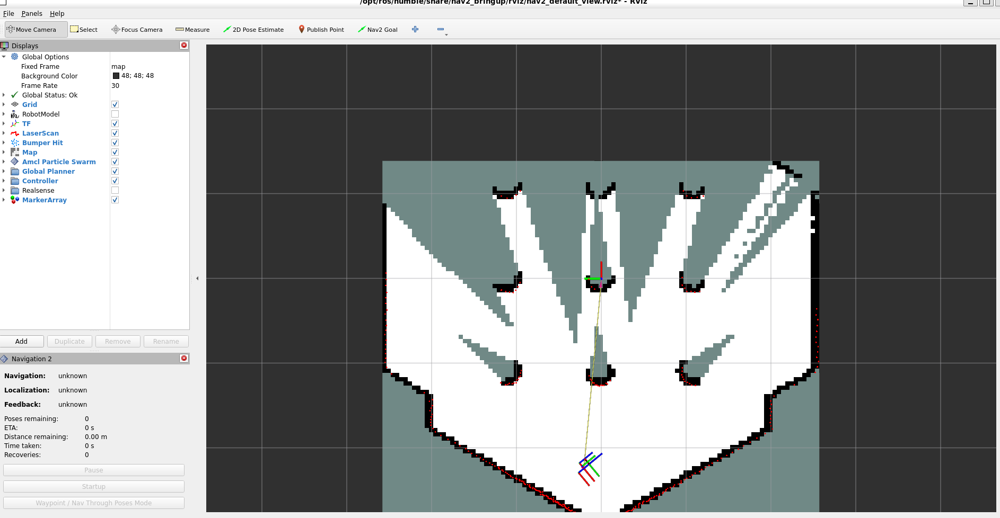

# RViz2 in ROS2: Visualizing Your Robot World

## What is RViz2?

RViz2 is a powerful 3D visualization tool in ROS2 (Robot Operating System 2). Think of it like a virtual window into your robot's world. It helps you see:

- Your robot's 3D model
- Sensor data (like laser scans from LIDAR)
- Maps created by SLAM (Simultaneous Localization and Mapping)
- The relationships between different parts of your robot (called transforms or TF)

In simple terms, RViz2 turns abstract data from your robot into pictures you can understand. This is super useful for debugging, testing, and understanding what's happening in your robotic system.

## Our Example: TurtleBot3 with SLAM

In this tutorial, we'll use RViz2 to visualize a TurtleBot3 robot in a simulated world. We'll see how the visualization changes when we add SLAM (a way for robots to build maps and know where they are).

### Prerequisites

First, set up your TurtleBot3 model:

```bash
echo "export TURTLEBOT3_MODEL=burger" >> ~/.bashrc
echo $TURTLEBOT3_MODEL
```

### Step 1: Launch the Simulation World

Start Gazebo with the TurtleBot3 world:

```bash
ros2 launch turtlebot3_gazebo turtlebot3_world.launch.py
```

### Step 2: Check Available Topics (Before SLAM)

Topics are like channels where ROS2 nodes send and receive data. Let's see what's available:

```bash
ros2 topic list
```

Output:

```
/cmd_vel
/odom
/scan
/tf
/tf_static
```

- `/cmd_vel`: Commands to move the robot
- `/odom`: Odometry data (robot's estimated position)
- `/scan`: Laser scan data from the LIDAR sensor
- `/tf` and `/tf_static`: Transform data (how different parts relate spatially)

At this point, RViz2 wouldn't show much useful information because there's no map yet.

### Step 3: Launch SLAM Toolbox

SLAM helps the robot build a map of its environment while figuring out its location:

```bash
ros2 launch slam_toolbox online_async_launch.py
```

### Step 4: Check Topics After SLAM

Now let's see the new topics:

```bash
ros2 topic list
```

New topics include:

```
/clock
/cmd_vel
/imu
/joint_states
/map
/map_metadata
/odom
/parameter_events
/performance_metrics
/pose
/robot_description
/rosout
/scan
/slam_toolbox/feedback
/slam_toolbox/graph_visualization
/slam_toolbox/scan_visualization
/slam_toolbox/update
/tf
/tf_static
```

Key additions:

- `/map`: The map being built by SLAM
- `/map_metadata`: Information about the map
- Various SLAM-specific topics

### Step 5: Launch RViz2

Now RViz2 can show meaningful data:

```bash
ros2 launch nav2_bringup rviz_launch.py
```



In RViz2, you can now add displays for:

- RobotModel (to see the 3D robot)
- LaserScan (to see the LIDAR data)
- Map (to see the SLAM-generated map)
- TF (to see the coordinate frames)

### Step 6: Control the Robot

You can drive the robot around to help SLAM build the map:

Using teleop keyboard:

```bash
ros2 run teleop_twist_keyboard teleop_twist_keyboard
```

Or publishing velocity commands:

```bash
ros2 topic pub /cmd_vel geometry_msgs/msg/Twist "{linear: {x: 0.2}, angular: {z: 0.5}}"
```

[Click here to check simulation](image/tortoisebot3.mp4)

### Understanding Transforms (TF)

Transforms describe how different coordinate frames relate to each other. For example:

- `map`: The global map frame
- `odom`: The odometry frame (relative to starting position)
- `base_link`: The robot's main body frame

Before SLAM, the TF tree might look like this (see [TF frames snapshot 1](frames_2026-01-19_12.17.26.gv)):

After SLAM starts building the map, the TF tree includes the map frame (see [TF frames snapshot 2](frames_2026-01-19_12.17.46.gv) and [TF frames snapshot 3](frames_2026-01-19_12.17.55.gv)).

You can generate your own TF tree visualization:

```bash
ros2 run tf2_tools view_frames
```

### Recording and Playing Back Data

To save data for later analysis in RViz2:

Record a bag:

```bash
ros2 bag record -a -o rviz2_bag
```

Stop recording with Ctrl+C.

Play back the bag:

```bash
ros2 bag play rviz2_bag
```

Check bag info:

```bash
ros2 bag info rviz2_bag
```

The recorded bag files are in the [rviz2_bag/](rviz2_bag/) folder.

## Key Takeaways

- RViz2 visualizes your ROS2 system's data in 3D
- SLAM adds mapping capabilities, enabling richer visualizations
- Transforms (TF) show spatial relationships between robot components
- Bags allow you to record and replay ROS2 data for analysis

This setup demonstrates how RViz2 brings your robot's abstract data to life!
